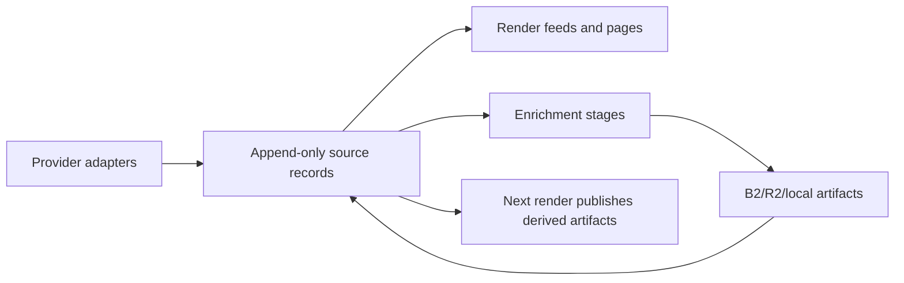

# Codex Architecture, Throughput, and Roadmap Review

Date: 2026-06-07

Reviewer: Codex

Scope: review only. This document summarizes architecture, throughput, roadmap, product, and
maintainability recommendations. It does not implement any changes.

## What I Inspected

- Current repository state on branch `fix/enrich-preemption-ci`.
- Prior review documents: `review/00-overview.md` through `review/09-infra-1-9-pr-audit.md`.
- Project docs: `README.md`, `ROADMAP.md`, `PLAN.md`, `CONTRIBUTING.md`, `.github/ADD_CITY.md`.
- Workflows: `.github/workflows/ci.yml`, `preview.yml`, `deploy.yml`, `audit.yml`,
  `contracts.yml`.
- Core code paths: providers, records, stages, timeline, media, ASR, state sync, audit,
  projection/report, CLI, feed rendering, validation, and tests.
- GitHub Actions history via `gh`, especially Build & Deploy runs:
  - `27085094231` - post-PR #221 main push, render and Pages deploy completed, enrich still in
    progress at inspection time.
  - `27074679697` - post-PR #220 ASR merge, failed after exit 143 behavior.
  - `27073734000` - scheduled run that succeeded but showed a large transcript backlog.
  - `27068556609`, `27068011658`, `27063436832` - failed scheduled/push runs around ASR,
    preemption, and OOM/shutdown behavior.
- Open GitHub issues via `gh issue list`, including feed-health issues and roadmap issues
  `#110`, `#141`, `#153`-`#157`.
- Official GitHub Actions docs for current free/public-repo runner constraints:
  - <https://docs.github.com/en/actions/concepts/billing-and-usage>
  - <https://docs.github.com/en/actions/reference/limits>

Validation performed:

```bash
pytest -q
# 690 passed, 4 deselected in 22.22s

ruff check .
# All checks passed!

ruff format --check .
# 85 files already formatted
```

## Executive Summary

The project is in a much stronger architectural position than the older reviews imply. The
provider abstraction, append-only records, content-addressed artifacts, render/enrich split,
timeline/EDL model, source media cache, SSRF gate, durable state sync, and test suite are all good
foundations. I would not recommend a broad rewrite or a move away from the static-site plus object
storage model right now.

The main risk has shifted. Earlier reviews focused on getting durable state, endpoint contracts,
resource links, feed health, and safe media ingestion in place. Those are now largely present. The
current bottleneck is operational throughput on GitHub-hosted runners, especially ASR transcripts
competing with audio/timeline work inside the same long-running enrich job.

The most valuable next architectural move is to make heavy enrichment more schedulable. In
practice that means treating stages as first-class resumable queues, then splitting ASR into its
own workflow or resource class once state writes can be coordinated safely. This gives the project
more throughput on the public-repo free tier without changing the product hosting model.

The most valuable quick PR is documentation and observability reconciliation. `ROADMAP.md`,
`.github/ADD_CITY.md`, and parts of the admin projection still describe older assumptions such as
`materialize_budget_per_run` and unshipped ASR/transcript work. Future Claude/Codex work will be
much safer if those maps are brought back in sync with the actual code.

## Keep These Design Choices

These are worth preserving as intentional architecture:

- Static rendering to `docs/` plus object storage for derived audio/transcripts. This keeps
  hosting simple, cheap, and inspectable.
- Provider adapters behind a normalized episode model. This is still the right way to add
  Legistar, Cablecast, YouTube, or other sources later.
- Append-only source records with stable identity and content-addressed artifact keys. This is the
  right basis for content permanence and safe rebuilds.
- Split hashes: source identity, audio spec hash, feed content hash, timeline digest. This gives
  precise invalidation without needless feed churn.
- Timeline/EDL model before audio manipulation. Silence trim, concat, intros/outros, clips,
  source-time links, and soundbites all become easier because this model exists.
- Render before enrich in production. Pages should deploy quickly from already-known state; heavy
  enrichment should be best-effort and resumable.
- SSRF/redirect/response caps and provider host allowlists. Keep this security boundary firm as
  onboarding opens up.
- Offline fixture-heavy tests. The suite is now large and fast enough to protect agent-assisted
  development.

## Highest Priority Recommendations

| ID | Recommendation | Suggested branch type | Why it matters | Tradeoffs |
|---|---|---|---|---|
| R1 | Add a manual fixed-budget ASR benchmark workflow first, then split ASR into scheduled/sharded workflows only after safe state coordination and throughput settings are proven. | Feature branch / ops architecture | ASR is now the dominant backlog and reliability risk. A benchmark workflow measures transcript minutes per runner hour; later sharding is the real backlog-clearing path without holding the Pages/enrich concurrency group hostage. | Requires careful state merging or source-level leases before scheduled shards; benchmark results may show model/settings tradeoffs before architecture work pays off. |
| R2 | Add a stage scheduler/backlog manifest with per-stage priorities, resource limits, and observed throughput. | Feature branch | The current stage list is clean, but scheduling is implicit. A manifest lets the project choose "recent visible audio first, then transcripts, then deep archive" deliberately. | More orchestration code and status UI, but it can be incremental. |
| R3 | Fix `citypods report` and admin projections to model wall-clock, per-stage throughput instead of the legacy per-run cap. | Quick PR | `report.py` still defaults `materialize_budget_per_run` to 25 when absent. Production is now wall-clock bounded, so the report can mislead planning. | Requires updating projection tests and admin copy. |
| R4 | Reconcile roadmap, issues, README, `.github/ADD_CITY.md`, and review docs against shipped work. | Quick PR | ASR, transcript tags, host-all audio, loudness, silence trim, Swagit concat, durable state, and timeline foundation are ahead of `ROADMAP.md`. | Mostly documentation, but issue triage needs judgment. |
| R5 | Make feed-health issues catch-up aware. | Quick PR / feature branch | Many open `rehost-backlog` issues appear to be operational backfill status rather than permanent broken feeds. | Needs clear states so real broken feeds are not hidden. |
| R6 | Add a feed-validation publish gate in the production deploy path. | Quick PR | Validation exists in tests, but production should fail before Pages upload if generated feeds are structurally invalid. | Must avoid blocking deploy because one already-known empty feed is expected; define the policy carefully. |
| R7 | Build per-meeting pages and transcript search as the next user-facing layer. | Feature branch | This turns feeds from passive subscriptions into a civic research tool. It also unlocks agenda links, source-time snippets, and shareable quotes. | Needs UI/design work and search index size management. |
| R8 | Add a Strong Towns issue lens: tags, watchlists, and alerts around land use, fiscal liability, transportation, and maintenance. | Research spike, then feature branches | This is the product direction most aligned with citizen activists. | LLM/keyword classification must be transparent and correctable. |
| R9 | Create a contributor/agent handoff guide. | Quick PR | The codebase is now sophisticated enough that future Claude/Codex work needs a canonical map and "when you change X, update Y" checklist. | Documentation needs maintenance discipline. |

## Architecture Review

### Current Shape

The architecture is now roughly:



This is a good shape for the project. It gives a clean separation between official source
discovery, durable local state, derived artifacts, and static publishing.

The stage architecture in `citypods/stages.py` is also conceptually sound. The module explicitly
documents how expensive stages should check `ctx.stop()` and how cheap idempotent bookkeeping
should always finish. That convention is exactly what lets a GitHub Actions run yield without
corrupting state.

### Architectural Change I Would Make

Move from "ordered stages inside one enrich job" toward "ordered, resumable stage queues." This
does not require a rewrite. It can start as a small durable manifest written alongside existing
state:

```text
state/
  run_summary.json
  run_history.jsonl
  work/
    audio.json
    transcript.json
    timeline.json
```

Each work file can track:

- source key
- episode uid
- stage name and stage version
- current state: queued, running, done, backoff, dead
- visible priority: current feed item, recent archive item, deep archive
- estimated seconds and observed seconds
- last error and next retry time
- lock/lease owner if concurrent workflows are introduced

This would make future changes easier:

- ASR can run in a separate workflow without guessing what remains.
- Recent user-visible episodes can be prioritized over old archive backlog.
- Stage budgets can be allocated deliberately instead of consumed by whichever source happens to
  enter the thread pool first.
- The admin/status page can show "why is this feed still missing audio/transcripts?" directly.

### Split ASR Carefully

ASR is the best candidate for a separate workflow, but only after state coordination is explicit.
The current Build & Deploy workflow serializes render, deploy, and enrich through one `pages`
concurrency group. That is conservative and safe because there is only one writer to the state
snapshot at a time.

A separate ASR workflow should avoid two writers clobbering the same record file. Options:

- Source-sharded concurrency groups: `asr-${source_key}` or `asr-shard-${n}`.
- Per-source state files with merge-on-push.
- A lightweight lease file in object storage with expiration.
- A single ASR workflow that runs after enrich and remains the only state writer, but has a
  different concurrency group from Pages deploy.

Recommended first version:

1. Add a transcript backlog manifest in the existing enrich workflow.
2. Add `citypods enrich --stage transcript --source <key>` or equivalent.
3. Create a manual ASR benchmark workflow with low concurrency, probably one matrix shard at
   first, so ASR changes can be measured under the same wall-clock budget.
4. Let render ignore in-progress ASR and publish only completed transcript artifacts.
5. Convert the benchmark workflow into scheduled/sharded ASR only after status proves state
   merging is safe and the throughput settings are known.

### Stage Ordering

The current order is reasonable:

- resource links are cheap and render-safe
- chapters/timeline/remap feed audio bytes
- audio materialization uses the finalized timeline and chapters
- transcripts run after hosted audio exists

Do not put LLM summaries ahead of audio/transcripts. Summaries are valuable, but the project should
first clear the artifact backlog that makes meetings listenable, searchable, and quoteable.

### Timeline Caveat

The EDL model is one of the best parts of the current design. Keep it. Before changing silence
parameters or adding new transforms, add a short stage-version/backfill playbook:

- What version bump changes the artifact hash?
- How many episodes will re-encode?
- How many runs will it take?
- Is the change worth applying to old archive items, or only new/current items?
- What status/report fields should show the backlog?

This matters because audio pipeline changes now create large, gradual rebuilds. The code can
handle that, but future agents need a checklist before turning knobs.

## Throughput and GitHub Free-Tier Scaling

### Current Production Constraints

Relevant current config:

- Build schedule: every 4 hours.
- Enrich window: `run_time_budget_minutes: 240` times `budget_safety: 0.85`, so about 204 minutes
  of useful heavy work, leaving tail time before the next cron tick.
- Outer source workers: `max_workers: 20`.
- Inner per-source media workers: `max_encodes_per_source: 4`.
- ASR workers: `asr_workers: 1`.
- Per-encode timeout: 45 minutes.

Official GitHub docs currently say standard GitHub-hosted runners are free for public
repositories, but practical limits still apply: a GitHub-hosted job has a 6-hour execution cap,
Free has 20 standard concurrent jobs, cache/storage limits exist, and `GITHUB_TOKEN` is limited to
1,000 requests per hour per repo. So the scaling opportunity is real, but it should be used with
polite, bounded sharding rather than unbounded parallelism.

### Actions Evidence

Recent Build & Deploy history shows the architecture works, but the heavy phase is strained:

| Run | Result at inspection | What it suggests |
|---|---|---|
| `27085094231` | In progress. Render, report, Pages upload, and Pages deploy all completed by `06:40Z`; enrich was still running. | The render/deploy split is doing its job. Users get a fresh site before heavy work finishes. |
| `27073734000` | Success. Enrich summary showed `audio: 186 ran ... 324 reused ... 3981 queued`; `transcript: 4 ran ... 3679 queued ... 44 errors`; transcript stage reported very large seconds. | Backlog is now dominated by transcripts. ASR throughput is far below the desired catch-up rate. |
| `27074679697` | Failure after ASR merge; logs showed graceful-yield/exit-143 behavior. | The system was close to resumable, but process shutdown/native ASR work could still hold the job. |
| `27068556609` and `27068011658` | Failures around queued-run shutdown and ASR concurrency. | ASR needed global throttling and fast-yield logic. Recent commits address this directionally. |
| `27063436832` | Failure with exit 137. | OOM was a real risk when model loading overlapped ffmpeg/source-worker concurrency. |

The last 12 Build & Deploy runs visible at inspection included 8 failures, 2 cancellations, 1
success, and 1 in-progress run. Most of that turbulence is clustered around the ASR rollout and
preemption fixes, but it is enough evidence to prioritize operational hardening before adding
more heavy features.

### Throughput Recommendations

1. Separate resource classes.

Audio encoding, chapter scraping, silence planning, and ASR do not consume the runner in the same
way. Treat them separately:

- chapter/link work: network-bound, cheap, can run broadly
- audio encode/source download: ffmpeg and remote-source bound, moderate memory
- ASR: CPU and memory bound, should be serialized or carefully sharded
- future LLM summaries: API-cost and rate-limit bound

2. Add visible-priority scheduling.

The most recent episodes in currently rendered feeds should get audio and transcripts before deep
archive items. The `_materialize_set()` helper already points in this direction. Make the policy
visible in status and in the work manifest.

3. Use separate workflows only after adding state coordination.

Good eventual workflow split:

```text
Build & Deploy
  render -> report -> deploy Pages

Enrich Audio
  chapters/timeline/remap/audio -> push state

Enrich Transcripts
  transcript alignment/transcription -> push state

Audit
  feed health, endpoint contracts, issue reconciliation
```

The key is that each workflow must either own non-overlapping source shards or merge state safely.

4. Keep the 4-hour cadence for render, use separate ASR workflows first for measurement.

Render should stay frequent. A daily or manually dispatched ASR workflow does not bypass the
6-hour GitHub-hosted job cap and should not be treated as extra single-job capacity. Its main
benefit before the backlog manifest exists is controlled measurement: run ASR with a fixed
wall-clock budget, compare model/beam/thread/cache/scheduling changes, and record transcript
minutes completed per runner hour plus quality/error rates. Once the best settings are known,
real backlog clearing should come from safe scheduled shards, with each job still bounded below
the 6-hour cap.

5. Add "estimated time to clear" to admin/status and feed-health issues.

The project already has enough run history and stage totals to estimate:

- audio backlog days
- transcript backlog days
- per-provider/source error rate
- current feed-visible missing artifacts
- deep archive missing artifacts

This would make feed-health issues less alarming and more actionable.

## Projection and Admin Report

The resource model was a good early planning tool, but it has drifted from production.

Specific issue:

- `citypods/report.py` builds `ModelInputs(... per_run_cap=int(defaults.get("materialize_budget_per_run", 25)))`.
- `config/site_config.yml` no longer uses `materialize_budget_per_run`; production is wall-clock
  bounded.
- `to_markdown()` can therefore report that a cap of 25 is the bottleneck and suggest
  `materialize_budget_per_run`, even though that is no longer the production control.
- `.github/ADD_CITY.md` still tells maintainers new Swagit/CivicPlus feeds are bounded by
  `materialize_budget_per_run`.

Recommended quick PR:

- Set `per_run_cap` to `None` when the setting is absent.
- Rename UI/copy from "per-run cap" to "stage throughput" or "legacy cap" where appropriate.
- Calibrate audio throughput from `materialize_encoded`, not `materialized`, because credited
  objects are cheap metadata work.
- Add transcript throughput to the report using `stage_totals.transcript.aligned`,
  `transcribed`, `seconds`, `backlog`, and errors.
- Add explicit "audio backlog" and "transcript backlog" rows rather than one generic full
  backfill number.
- Update tests in `tests/test_report.py` to cover the no-cap wall-clock case as the default.

Benefits:

- Backlog estimates become trustworthy.
- Future ASR/model changes can be evaluated before being merged.
- Feed-health issues can include realistic ETAs.

Tradeoff:

- The projection model becomes less simple, but the current simple model is already simple in a
  way that can mislead decisions.

## Feed Health and Issue Hygiene

The automated feed-health system is valuable, but its current issue set mixes several different
states:

- real broken feeds
- provider view caps
- stale/no-new-meeting warnings
- rehost backlog while derived artifacts are still catching up
- old issues opened before host-all/audio/transcript changes landed

Recommendations:

1. Split `rehost-backlog` into at least two statuses.

- `rehost-backlog:catching-up` - pipeline is making progress; include ETA.
- `rehost-backlog:stalled` - no progress after N successful enrich runs.

2. Auto-comment on backlog issues when status changes.

Example fields:

- current hosted count
- current feed-visible missing count
- transcript queued count
- last successful stage run
- estimated remaining runs

3. Reconcile open roadmap issues.

At inspection time:

- `#154` tracks `<podcast:transcript>` emission, but `citypods/feeds.py` and
  `templates/feed.xml.j2` already emit `<podcast:transcript>` for synced hosted transcripts.
  This issue may be closeable or should be narrowed to "verify in production feeds after ASR
  backfill."
- `#110` ASR transcripts has a merged implementation path, but likely still represents backfill
  and operational follow-up. Rename or split it to avoid future agents reimplementing ASR.
- `#141` timeline foundation appears largely implemented through the INFRA stack. Keep it open
  only if it is acting as an umbrella for remaining user-facing features.
- `#153`-`#157` are still sensible product issues, especially per-meeting pages and soundbites.

4. Do not hide real errors.

Catch-up awareness should not silence dead provider media, expired URLs, SSRF rejects, or provider
contract drift. The issue body should show whether a feed is "waiting on our backlog" or "blocked
by source/provider failure."

## Roadmap Reconciliation

`ROADMAP.md` is no longer an accurate 1.0 plan. It lists several shipped or partially shipped
features as future:

- ASR transcripts
- `<podcast:transcript>`
- silence trim / timeline transform
- loudness normalization
- host-all audio
- official meetings links
- content permanence / append-only archive
- admin/status work

Recommended docs PR:

- Add a "Shipped since reviews 08/09" section.
- Move ASR, transcripts, host-all audio, loudness, silence trim, timeline foundation, and Swagit
  concat out of the future backlog and into shipped/operational follow-up.
- Add an "Operational hardening before 1.0" section:
  - ASR workflow isolation or stage scheduler
  - projection/report wall-clock fix
  - feed-health catch-up status
  - production feed-validation gate
  - roadmap/issue cleanup
- Keep per-meeting pages, search, topic tags, summaries, soundbites, analytics, OPML, and ICS as
  product backlog.

Future Claude/Codex handoff note:

- I found no dedicated `CLAUDE.md`, `.agents/`, `.codex/`, or local memory file in this checkout.
  For now, `review/10-codex-architecture-throughput-roadmap-review.md` should be the handoff
  anchor.
- When a future PR implements one of these actions, update the relevant durable docs:
  - `ROADMAP.md` for priority/status changes
  - `README.md` and `.github/ADD_CITY.md` for maintainer workflows
  - `CONTRIBUTING.md` when contribution expectations change
  - the matching `review/` document or a new review addendum for architectural decisions
  - GitHub issues for closed, narrowed, or superseded roadmap items

## Product Features Worth Adding

### Highest Value for Citizen Activists

1. Per-meeting permalink pages.

Each meeting should have a stable page with:

- audio player
- transcript
- chapters/agenda items
- official agenda/minutes/video links
- source-time links back to the city archive
- shareable quote/deep-link snippets
- "report a problem" link

This is the product hinge between podcast feeds and civic research.

2. Transcript search.

Start simple:

- static generated JSON index per city/source
- search title, body, date, agenda/resource link text, transcript text
- result snippets with transcript timestamps
- filters by city, body, date, topic

Do not require a server until static search proves insufficient.

3. Strong Towns topic tags.

Useful tags for local activists:

- zoning reform
- parking mandates
- minimum lot size / setbacks
- housing supply
- accessory dwelling units
- annexation / outward expansion
- road widening
- street safety / Vision Zero
- sidewalk, bike, transit access
- infrastructure maintenance liability
- debt, bonds, tax increment financing, subsidies
- downtown incremental development
- small business permitting
- stormwater and utility maintenance
- budget structural balance

Implementation path:

- Start with transparent keyword/rule-based tags from agendas and transcripts.
- Add human-editable overrides in state/config.
- Add LLM classification only after transcripts are stable and with confidence/explanation fields.

4. Watchlists and alerts.

Citizen activists need to know when a topic appears, not just browse after the fact:

- RSS feeds by topic/tag
- per-city watchlists
- "new meeting mentions parking minimums" alerts
- OPML export for all feeds in a city
- weekly digest generated as a static page or feed first; email later

5. Agenda-first summaries.

Before broad AI summaries, generate structured "what changed?" cards from official agenda/minutes
and transcript snippets:

- agenda item title
- action taken if minutes provide it
- vote if available from provider metadata/minutes
- transcript excerpts and timestamps
- official document links

This is more useful, auditable, and less risky than freeform meeting summaries.

6. Compare bodies and cities.

Strong Towns users often watch patterns:

- which boards discuss land use most
- how often housing/parking/street design appears
- which cities have stale or inaccessible meeting archives
- which cities publish agendas/minutes/transcripts reliably

This can become a public accountability layer without much new infrastructure.

### Product Features to Defer

- Speaker diarization. Nice later, but not necessary before transcript search and summaries.
- Full video re-hosting. Storage and legal/policy surface are much bigger than audio.
- Custom query feed builder with user accounts. Static topic feeds and OPML are simpler.
- Email delivery. Generate RSS/static digests first.
- Heavy LLM summaries for every archive item before ASR backlog is under control.

## Maintainability and Collaboration

### Strengths

- Test coverage is excellent for the project size: 690 passing tests, broad fixture coverage, and
  targeted tests for timeline, transcripts, stages, records, audit, workflows, security, reports,
  providers, and feeds.
- Provider-specific code is reasonably contained.
- Security-sensitive HTTP and source URL checks are centralized.
- The stage docstring is unusually useful and should be preserved.
- Prior review docs are detailed enough to serve as design history.

### Maintainability Risks

Large modules are starting to carry too many responsibilities:

- `citypods/stages.py` - 1084 lines
- `citypods/run.py` - 910 lines
- `citypods/media.py` - 823 lines
- `citypods/audit.py` - 776 lines
- `citypods/report.py` - 692 lines

I would not refactor these just for size. But when touching the relevant areas, extract along
natural boundaries:

- `stages/transcript.py` for ASR/transcript stage logic
- `stages/audio.py` and `stages/timeline.py` if stage scheduler work begins
- `ops/scheduler.py` or `workqueue.py` for backlog manifests and leases
- `report/status.py` versus `report/projection.py` if admin work grows
- `audit/issues.py` for GitHub issue reconciliation separate from local feed checks

### Contributor Experience

Before actively inviting contributors, add:

- `docs/architecture.md` or a short `review/README.md` index that explains the current system.
- "How to add a stage" guide.
- "How to add a provider" guide with required tests/fixtures/security checks.
- "How to update generated feeds/snapshots" guide.
- Labels and issue templates for:
  - provider adapter
  - feed-health
  - docs-only
  - good first issue
  - needs fixture
  - needs live verification
- A PR checklist:
  - tests added/updated
  - roadmap/review docs updated if status changed
  - feed snapshots updated intentionally
  - no provider network calls in normal CI
  - no change to artifact identity without migration note

## Security and Reliability Notes

The security posture is better than the average civic scraper:

- SSRF guard exists.
- Provider host allowlists exist.
- Redirects and response size are bounded.
- XML parsing uses safer patterns.
- ffmpeg protocol whitelist exists.
- State is durable and reconciled from object storage.

Recommendations:

- Keep live endpoint contract tests out of normal PR CI unless explicitly opted in.
- Add a production feed-validation gate before Pages upload.
- Treat future LLM calls as untrusted output. Generated summaries/tags should never overwrite
  official links, titles, dates, or transcript text.
- If adding analytics, keep the OP3-style privacy posture in issue `#125`: aggregate downloads,
  no invasive per-user tracking.
- If adding external user submissions, keep the same SSRF/security gate before any fetch.

## Suggested Branch Plan

Quick PRs:

- `docs/roadmap-reconcile-2026-06`
  - Update `ROADMAP.md`, `README.md`, `.github/ADD_CITY.md`, issue statuses.
- `fix/projection-wall-clock-stages`
  - Remove stale default cap, add per-stage transcript/audio throughput.
- `fix/feed-validation-publish-gate`
  - Validate generated feeds before Pages artifact upload.
- `fix/feed-health-catchup-copy`
  - Distinguish catch-up backlog from broken feeds in issue bodies/status.
- `docs/agent-handoff-guide`
  - Add current architecture map and update checklist for Claude/Codex-assisted work.

Feature branches:

- `ops/stage-backlog-manifest`
  - Durable stage queue/work manifest, visible backlog, source priority.
- `ops/asr-benchmark-workflow`
  - Manual transcript workflow for fixed-budget ASR throughput and quality measurements.
- `ops/asr-workflow-split`
  - Scheduled/sharded transcript workflow after state coordination and throughput settings are
    proven.
- `feat/per-meeting-pages`
  - Stable meeting pages with transcript/resources/timestamps.
- `feat/static-transcript-search`
  - Search index and UI over meeting pages.
- `feat/strong-towns-topic-tags`
  - Transparent topic taxonomy, rules, overrides, then optional LLM assist.
- `feat/watchlists-topic-feeds`
  - RSS/OPML/topic feeds and city watchlists.

Research spikes:

- `spike/asr-model-benchmark`
  - Compare `large-v3-turbo`, `small.en`, and `base.en` on representative city meetings with
    official transcripts. Track transcript minutes completed per runner hour, WER/alignment
    failure rate, timeout/error rate, and model-load overhead.
- `spike/provider-discovery`
  - Rank next providers/cities by reach and source quality.
- `spike/static-search-size`
  - Measure browser performance and index size for transcript search at current and 1,000-feed
    scale.

Major architecture, only if needed later:

- Move from static files to a hosted database/API. Not recommended now.
- Move media processing off GitHub Actions. Not necessary yet for a public repo, but keep it as a
  fallback if runner reliability or policy changes.
- Full video hosting. Defer unless there is a strong user need and a storage/legal plan.

## My Recommended Sequence

1. Land the docs/roadmap reconciliation PR.
2. Land the projection/admin wall-clock fix.
3. Watch the next several Build & Deploy runs after PR #221 to confirm the new fast-yield behavior
   and ASR semaphore are enough to keep jobs green.
4. If enrich still blocks or fails, prioritize `ops/stage-backlog-manifest` before more ASR
   feature work.
5. Add a manual fixed-budget ASR benchmark workflow to compare throughput changes.
6. Split ASR into scheduled/sharded workflows once state coordination and benchmark results exist.
7. Build per-meeting pages.
8. Add static transcript search.
9. Add Strong Towns topic tags/watchlists.

This sequence keeps the project reliable while moving toward the higher-value civic product.
