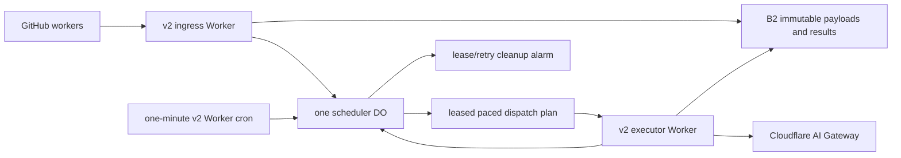

# review/44 — Bounded bundled LLM dispatch with Durable Objects

**Maturity: L3 dev-ready · authored 2026-08-17, matured to L3 2026-08-17 · proposed parallel
successor to the R10 Worker**

Owner: dispatch Worker maintainers. Scope: a new `workers/llm-dispatch-v2/` deployment, the
`citypods.compute` dispatch client, and GitHub workflow configuration. The existing
`workers/llm-dispatch-proxy/` remains the production transport until this design meets its canary
and parity gates.

## Demand model

This design exists because the dispatch Worker was invoked ~126,000 times on 2026-08-17. That
figure needs unpacking before it can drive any capacity decision, because taken at face value it
implies a scale of problem this design doesn't actually solve.

- **~126k is Worker HTTP invocations, not LLM calls.** Real LLM calls that same day, per Cloudflare
  AI Gateway: **~2,600 measured by 18:00** (~18 hours in), extrapolating to roughly **3,000–3,500/day**
  at that pace — and Worker invocations crossed the 100,000/day Workers Free ceiling within that
  same ~18-hour window. The acute breach happened fast, driven by submission rate, not a full day's
  accumulation.
  - **Inferred cause (needs confirmation against Workers Logs before being treated as fact): a
    backfill.** `reset-agenda-chapter-state.yml`
    ([f54e4d9](https://github.com/BashfulBits/city-meeting-podcasts/commit/f54e4d9)) clears
    `agenda_text_artifact_key`-less records so the pipeline rediscovers agendas and chapter lanes
    "submit their normal Mistral and Gemini jobs" again — almost certainly the backfill in
    progress. Combined with v1's ingress path — one synchronous POST per `InferenceJob` — a bulk
    rebuild of chapter/tag records plausibly explains the ~126k/~2,600 gap.
  - **Correction from review/43's own measured request-shape model: don't assume it's all
    ingress.** review/43's production request-shape table (`enqueue`/`dispatch`/`poll` at a given
    jobs/day rate) found polling — not enqueue — is the dominant share of Worker-request volume at
    scale: **~60% of the request budget at 50,000 jobs/day**, from the existing ~2.5-polls-per-job
    `JobHandle` reconciliation sweep (automated, run as part of normal pipeline operation — distinct
    from ad hoc manual/interactive polling). The Workers Logs breakdown in Verification must
    therefore split invocations by `enqueue-batch` vs. `poll-batch` vs. cron-dispatch, not assume
    ingress is the whole story. This directly changes Phase 1's scope below: batching enqueue alone
    may not resolve the incident if reconciliation polling turns out to be the larger share.
- **Steady-state dispatch target: ~5,000 LLM calls/day** (near-max sustained submission rate at
  today's usage). This is **not the real provider-side ceiling** — see below — it's a working
  planning number for how much this design needs to *reliably sustain*, not the most it could ever
  need to admit.
- **Real aggregate free-route capacity is abundant, not scarce.** Summing `config/provider_limits.yml`:
  29 free routes with an explicit `rpd` total **66,620 requests/day**; a further 8 free Mistral
  routes carry only `rpm` (no daily cap encoded — nominally hundreds of thousands/day at full
  utilization). review/41's narrower 4–6-route mental model is stale; the catalog now spans 9
  providers (Gemini/Gemma, Mistral, Groq, SambaNova, SiliconFlow, Z.AI, OpenRouter, Kilo, OpenCode).
  **Routes are not the constraint on growth toward more cities.** This independently corroborates
  review/43's own 2026-08-14 measurement of **66,120/day** aggregate free-tier capacity (~46/minute)
  against which it found "provider rate limits are roughly 23x from binding" — two separate analyses
  landing on the same number, ~5 days apart, as the route catalog grew slightly.
- **The real Free-tier bottleneck is Cloudflare's own per-invocation Worker CPU limit (10ms) and
  the shared DO SQLite row-write/request budget (100,000/day)**, both of which scale with jobs
  actually dispatched — independent of whether cron-pull or a Queue triggers the dispatch. This is
  why "Why cron pull, not Queue" below is reasoned from CPU/SQLite cost, not from provider capacity.
  review/43 derived the equivalent v1 ceiling precisely: **Worker requests (100,000/day) bind around
  ~20,000 jobs/day "at today's request shape"** — i.e. before batching enqueue/poll — which is
  consistent with why a backfill submitting jobs one-at-a-time blew past the daily ceiling in hours,
  not days.

This reframes what "success" means for this design: it is not trying to raise LLM throughput toward
providers' real ~66,620+/day ceiling. It is trying to (a) stop v1's un-batched ingress path from
generating one Worker invocation per job created, which is what actually broke the Free-tier request
ceiling today, and (b) sustain a paced ~5,000/day dispatch rate reliably within Cloudflare's Worker
CPU and DO SQLite budgets, with a documented, numbered trigger for when those Free-tier budgets —
not provider quota — become the limiting factor.

## Decision

Build an opt-in, cron-pull Durable Object (DO) scheduler. Each existing one-minute Worker cron asks
the DO for one paced dispatch window. The DO atomically leases up to four LLM jobs and returns a
route-local plan with a safe relative `wait_ms` and auditable absolute `not_before_at` for each. The
Worker waits without busy-polling, starts every request whose planned time falls in the next 25
seconds, stores its results in B2, and reports every actual provider attempt in one completion call.
It uses stable provider idempotency keys where available and makes an unsupported provider's
post-start crash state explicit. R2 and Cloudflare Queues are not used by v2.

The design has two goals, in order:

1. Stay within every Workers Free daily ceiling with explicit configuration guards while getting
   useful parallel LLM throughput from each executor invocation.
2. Reduce race-prone coordination to one serialized scheduler and a small, fenced protocol.

This is a maintainer-directed parallel design deviation from review/43's staged "B2, batch API,
then choose Paid Workers or a DO" sequence. It does not accelerate or alter the legacy transport.
It creates an independently deployable v2 path, allowing selected GitHub workflows to migrate and
to roll back future submissions without losing accepted v2 jobs.

## Why cron pull, not Queue or a queue object

The initial v2 design used a Queue for a durable DO-to-Worker handoff. That is unnecessary when the
existing Worker cron is retained: its next invocation is already the bounded, independent execution
event. The DO neither starts a Worker nor waits for model latency.

The Worker must not claim work by deleting or overwriting a B2 queue object. A DO update after a
Worker reads a manifest but before it invalidates it could discard a newer ready set—the same
lost-work shape as the earlier agenda race. The DO's SQLite transaction is the sole claim point.

There is therefore no B2 queue-manifest read or write. A Worker performs one `claimDispatchWindow`
RPC; B2 is only prompt/result storage. The DO selects across all ready routes rather than exposing
the first objects in a storage prefix, eliminating route head-of-line blocking.

### Cron pull vs. a Cloudflare Queue push, reasoned from the actual bottleneck

This tradeoff was reopened and re-closed with numbers, because it's tempting to assume a Queue
would raise the achievable dispatch ceiling. It doesn't, and the reasoning matters enough to spell
out rather than assert:

- **What a Queue would need to buy:** either more successfully-dispatched LLM calls/day, or relief
  on Worker/DO request budget.
- **What it can't buy:** more calls than providers will accept — moot here, since real aggregate
  route capacity (~66,620+/day, see Demand model) is already roughly 15x the ~5,000/day target.
  Provider throughput was never the limit.
- **What it also can't buy: relief on the actual binding costs.** DO SQLite row-writes (lease,
  `attemptStarted`, `completeBatch`, cleanup) and Worker CPU-per-invocation are incurred per
  dispatched job under *either* transport — a Queue-triggered executor invocation does the same
  JSON/route work and writes the same rows as a cron-triggered one. A Queue's separate 10,000-op/day
  allowance doesn't touch either ceiling.
- **What it costs instead:** a new product surface, at-least-once delivery semantics layered on top
  of the fencing already built for cron-pull, a DO→Queue write that isn't atomic with the DO's own
  SQLite transaction (an outbox problem — bounded by the existing lease-reap fallback, but still
  added surface), and DLQ handling.

Cron-pull's ceiling (`MAX_BUNDLE_JOBS × 1,440 ticks/day`) is not route-constrained; it's
Worker-CPU- and DO-write-constrained, and a Queue doesn't relieve either constraint. **Decision:
keep cron-pull.** The `MAX_BUNDLE_JOBS=4` / `MAX_BUNDLES_PER_UTC_DAY=1,000` values below were chosen
conservatively, not derived from real route pacing — e.g. Gemma routes at 30 RPM could pace ~12
calls into one 25-second dispatch window; the config allows 4 — because they may instead be close
to a real Worker-CPU ceiling per invocation (review/43 measured v1 at ~8ms CPU for a single-job
dispatch against the 10ms Free-tier limit). v2 offloads most of that per-job bookkeeping into the
DO's own SQLite transaction — a separate CPU budget from the executor Worker's — so the executor's
CPU should be materially lower than v1's per-job cost, but this must be **profiled on the actual v2
code**, not assumed (see the profiling gate under "Bounded initial configuration").

**Set expectations from review/43's own measured data, not a clean linear model.** review/43
profiled v1's batch concurrency directly and found cost **superlinear above N≈2**: N=1→N=2 followed
the predicted ~0.90ms/operation rate, but N=2→N=3 cost ~2.8ms/op — three times the rate — and N=3
ended up *worse per-request* than N=2, from GC/live-set pressure of holding multiple resident
canonical records simultaneously, not from operation count. v2's executor holds B2 payloads and
Gateway responses resident per bundled job the same way v1 holds canonical records, so the same
mechanism plausibly applies. Treat `MAX_BUNDLE_JOBS = 4, 8, 12` in the profiling pass below as
covering the *plausible range*, not as equally likely outcomes — expect the safe ceiling to land
closer to the low end (v1's own wall was N=3) rather than assume Worker-CPU headroom scales cleanly
with job count. This does not change the decision to keep cron-pull; it only means "raise
`MAX_BUNDLE_JOBS` as far as profiling supports" (below) may support less than hoped, and that's fine
— the real target is ~5,000/day, comfortably reachable even at a small bundle size across 1,440
daily ticks.

**Documented growth trigger.** When profiled Worker-CPU or DO SQLite-write usage approaches 75% of
its Free-tier ceiling at the then-current dispatch volume, the next step is **Workers Paid
($5/mo)** — which raises the CPU-per-invocation limit from 10ms to 30s and lifts the other Free-tier
ceilings — not a Queue. A Queue adds complexity without relieving the constraint that's actually
binding; Workers Paid relieves it directly.



The scheduler is intentionally one deterministic DO instance, for example
`LLM_SCHEDULER.getByName("global-v2")`. A global per-route/provider ledger needs one serialization
point; sharding it would reintroduce the race this design removes. The DO stores only compact
control data and never prompt or response bodies.

### Components and responsibilities

- **Ingress Worker:** authenticates and validates a batch, stages B2 request payloads, calls
  `enqueueBatch`, and serves batched status reads. It never selects routes or reserves capacity.
- **Scheduler DO:** owns job/route state, leases, the ledger, pacing plan, attempt-start records,
  retry authorization, estimate calibration, and cleanup index. It never reads B2 payloads, starts a
  Worker, or awaits model calls.
- **Cron/executor Worker:** calls `claimDispatchWindow`, follows the returned route-local waits,
  reads B2, calls AI Gateway, writes B2 results, and reports every actual attempt in one completion
  batch. It never selects routes or mutates the ledger directly.
- **B2:** holds immutable request/result payloads and recoverable deleted versions. It never
  coordinates state or conditional admission.

## Bounded initial configuration

All values are Worker environment configuration with validation at startup. The initial values below
are deliberately conservative and become a tested capacity model, not tuning by convention.

| Setting | Initial value | Purpose |
| --- | ---: | --- |
| `MAX_BUNDLE_JOBS` | 4 | Maximum LLM calls claimed by one Worker cron |
| `MAX_JOBS_PER_ROUTE_PER_BUNDLE` | 4 | Allows a paced same-route sequence when it fits |
| `DISPATCH_WINDOW_SECONDS` | 25 | Latest planned provider-call start after a cron tick |
| `CRON_TICK_SECONDS` | 60 | Existing Worker dispatch cadence; bounds new-work latency |
| `MAX_ACTIVE_BUNDLES` | 2 | Bound for partially completed or abandoned dispatch plans |
| `MAX_IN_FLIGHT_LLM_CALLS` | 8 | Separate global cap; avoids one slow bundle serializing all work |
| `MAX_BUNDLES_PER_UTC_DAY` | 1,000 | Hard admission cap, below the 1,440 daily cron ticks |
| `MAX_JOBS_PER_UTC_DAY` | 20,000–50,000 (profiled gate) | Hard ingestion admission cap, independent of dispatch — bounds `enqueueBatch` inserts so a backfill-scale ingest can't itself exhaust the shared DO SQLite row-write budget (see Demand model and the split budget below) |
| `ENQUEUE_BATCH_MAX` | profiled gate (target: low hundreds to low thousands of jobs/call) | Jobs accepted per single `enqueue-batch` RPC — sized so reaching `MAX_JOBS_PER_UTC_DAY` takes tens of calls, not thousands |
| `POLL_BATCH_MAX` | profiled gate (target: enough to cover the largest single reconciliation sweep in one call — see note below) | Statuses/results returned per single `poll-batch` RPC |

**`POLL_BATCH_MAX` covers two different traffic shapes; size it for the larger one.** There are two
distinct poll use cases, not one: (a) the automated `JobHandle` reconciliation sweep that runs as
part of normal pipeline operation — review/43 measured this at ~2.5 polls/job in v1's current
unbatched shape, which is why it identified polling as ~60% of Worker-request volume at scale, not
a minor share — and (b) manual/interactive research or GitHub-issue-response polling, low-volume
(~100/day) by nature. Batching (a) into one `poll-batch` call per reconciliation run (Phase 1) is
what actually relieves request-count pressure; (b) was never the concern. Confirm the actual
enqueue/poll split for today's incident (Verification) before finalizing this value.
| `MAX_RESPONSE_SECONDS` | 720 | Shared response deadline; leaves finalization margin below 15 min |
| `FINALIZATION_RESERVE_SECONDS` | 90 | Time retained for B2 persistence and `completeBatch` |
| `LEASE_DURATION_SECONDS` | 840 | Covers deadline; stays below cron duration |
| `MAX_429_RETRIES` | 1 | Bounded same-route retry attempts inside one executor bundle |
| `MAX_429_BACKOFF_SECONDS` | 60 | Upper bound for in-Worker `Retry-After` sleep |
| `UNKNOWN_ATTEMPT_POLICY` | hold | Unsupported-provider crash after send; never silently reissue |
| `MAX_QUEUE_WAIT_SECONDS` | 3,600 | Aging escape hatch before size-based ordering |
| `ESTIMATE_MARGIN` | profiled gate | Conservative route/model/prompt-family reservation floor |
| `MAX_BUNDLE_PAYLOAD_BYTES` | profiled gate | Required cap before v2 deployment |
| `MAX_BUNDLE_RESULT_BYTES` | profiled gate | Required cap before v2 deployment |
| `MAX_B2_SUBREQUESTS` | profiled gate | Bounds I/O below connection ceiling |
| `COMPLETED_RETENTION_DAYS` | 38 | Bounded availability; matches deferred-handle horizon |

The scheduler rejects a deployment configuration whose projected usage exceeds 75% of a relevant
daily ceiling before retry and maintenance headroom. Scheduled invocations happen whether or not
there is work, so their fixed daily cost is accounted for separately:

| Free resource | Conservative daily use | Included daily limit |
| --- | ---: | ---: |
| Cron/executor Worker requests | 1,440 ticks | 100,000 |
| Scheduler DO requests | 1,440 claim + <=4k start + 1k finish + <=4k retry | 100,000 |
| DO SQLite row writes — dispatch-lifecycle | under 45,000 plus bounded cleanup (lease + `attemptStarted` + `completeBatch` + cleanup; profiled gate — scales with `MAX_BUNDLE_JOBS`/`MAX_BUNDLES_PER_UTC_DAY`) | shares the 100,000 total below with ingestion |
| DO SQLite row writes — ingestion | one insert per `enqueueBatch`-admitted job, up to `MAX_JOBS_PER_UTC_DAY` (profiled gate) | shares the 100,000 total below with dispatch-lifecycle |
| DO SQLite row writes — combined total | dispatch-lifecycle + ingestion, held under the 75% admission-rejection threshold | 100,000 |
| Queue operations | 0 | 10,000 |
| R2 operations from v2 | 0 | shared R2 allowance |
| LLM calls | up to 4,000 (see Demand model — this is the Free-tier-budget-driven ceiling, not a provider-capacity one; real aggregate route capacity is ~66,620+/day) | provider- and Gateway-limited |

Ingress and status requests share the Workers and DO limits, so the caps leave substantial request
headroom. Cloudflare counts DO alarm invocations and RPC sessions as DO requests, and each
`setAlarm()` as a SQLite row write. See
[DO pricing](https://developers.cloudflare.com/durable-objects/platform/pricing/).

**Ingestion admission is bounded on both ends, not just at the DO.** A DO-side admission cap
(`MAX_JOBS_PER_UTC_DAY`) alone still lets a runaway GitHub workflow hammer the ingress Worker with
rejected-but-still-counted requests — exactly today's failure mode (see Demand model). Client-side
throttling in `citypods/compute/llm.py`, and/or GitHub Actions `concurrency`/rate-limiting on the
calling workflows, must keep callers from making the request at all once known headroom is
exhausted, not merely handle the rejection after the fact.

The AI Gateway request is a separate product request. It is not a second Worker invocation, but its
provider quotas and its own rate limits remain authoritative. In particular, Cloudflare-managed
Unified Billing has a 200-request-per-60-second-per-gateway limit; BYOK does not use that specific
limit. See [AI Gateway limits](https://developers.cloudflare.com/ai-gateway/reference/limits/).

## Data model and protocol

### SQLite tables

The DO creates SQLite-backed tables in its constructor. Payload bytes are excluded by design.

- **`jobs`:** `id`, unique `idempotency_key`, stable provider idempotency key, state, policy
  metadata, prompt family, conservative input/max-output token estimates, `payload_key`,
  `result_key`, and `priority` (`0` = admit/dispatch first, `1` = default); one compact control row
  per LLM job.
- **`routes`:** `route_id`, paced availability, full token-bucket budget, provisional reservations,
  settled usage, cost, and 429 state; the per-route/account ledger and adaptive buffer.
- **`bundles`:** `bundle_id`, state, lease expiry, active-call count, and dispatch-window end; the
  fenced Worker execution lease and its compact route-lane plan.
- **`attempts`:** job/attempt id, planned time, actual start/end time, observed usage, start state,
  and outcome; compact audit rows used to settle a provisional reservation from actual execution.
- **`estimates`:** route/model/prompt-family conservative margin, sample count, and bounded recent
  observed usage summary; it cannot lower a reservation below `ESTIMATE_MARGIN`.
- **`scheduler`:** UTC bundle count, cleanup cursor, and next maintenance alarm; small singleton
  state.

Job states are `queued`, `leased`, `unknown_attempt`, `completed`, `retryable`, `failed`, and
`purge_pending`. A job lease carries an opaque `lease_token`; an executor must present that exact
token to settle it. A bundle has a separate execution token, preventing overlapping cron
invocations from issuing duplicate provider calls.

### Ingress and status APIs

The public Worker, not the DO, exposes authenticated endpoints:

- **`POST /v2/jobs:enqueue-batch`:** accepts up to `ENQUEUE_BATCH_MAX` jobs, stages B2 payloads,
  and makes one `enqueueBatch` RPC. Each job may set an optional `priority: 0|1` (default `1`) —
  this is the only supported way to set priority; there is deliberately no separate API to edit
  priority on an already-queued job after the fact (that's a recovery/testing operation, not
  production traffic — Cloudflare's dashboard Data Studio and `wrangler dev`'s Local Explorer SQL
  Studio both support browsing and writing SQLite-backed DO storage directly, so a bespoke endpoint
  isn't needed; see the note under the ordering pass below).
- **`POST /v2/jobs:poll-batch`:** returns up to `POLL_BATCH_MAX` statuses/results in one DO RPC
  and bounded B2 reads.
- **`POST /v2/jobs/{id}:schema-retry`:** preserves schema-correction semantics with a new payload
  and idempotency namespace.
- **`POST /v2/jobs:resolve-unknown-batch`:** an authenticated, bounded operator/GitHub-worker
  action that acknowledges `unknown_attempt` records and creates explicit retry job identities.
- **`GET /healthz`:** does no B2 or DO work; used only for routing health.

The existing Python client batches all enqueue and poll operations available in a GitHub run. This
removes the old one-request-per-`JobHandle` correlation. Each handle records whether it belongs to
the legacy or v2 transport, so reconciliation never queries the wrong system.

Ingress preassigns each job id, writes its B2 payload, then makes one `enqueueBatch` RPC. A failed
or losing idempotency race can therefore leave an unreferenced payload object, which is safe and is
deleted by the bounded cleanup path. The DO validates an immutable request digest with the
idempotency key, so a reused key with different contents fails loudly rather than corrupting an
earlier job.

### Claim, ordering, pacing, and execution flow

1. `enqueueBatch` inserts compact queued jobs in one SQLite transaction. It updates the next
   maintenance alarm only for expired leases, retry eligibility, or cleanup; an alarm cannot wake a
   Worker and is not a dispatch mechanism.
2. At each one-minute cron tick, the executor calls `claimDispatchWindow(now, 25 seconds)`. The DO
   limits the plan by remaining bundle and in-flight-call capacity; it may return a partial plan. If
   a cap prevents admission, it returns an empty plan promptly.
3. In one transaction, the DO considers each candidate route's RPM gap, rolling TPM reservation,
   configured buffer, and repeated-429 `blocked_until`. `priority=0` jobs are ordered ahead of
   `priority=1` jobs within an otherwise-eligible set — a simple binary tie-breaker, not a
   scheduling class of its own. It first fills slots from distinct eligible routes. A job that has
   waited `MAX_QUEUE_WAIT_SECONDS` wins its eligible ordering bucket. For all other jobs, when more
   routes are eligible than slots and when filling remaining slots, it prefers larger conservative
   token estimates, then stable FIFO order. Only after that first pass may a second job from a route
   fill a slot. `priority` is set once, at `enqueueBatch` time (see the ingress API above); an
   operator changing it on an already-`queued` job for recovery/testing is a direct edit through
   Cloudflare's dashboard Data Studio or `wrangler dev`'s Local Explorer SQL Studio (both support
   browsing and writing SQLite-backed DO storage — [Access Durable Objects
   Storage](https://developers.cloudflare.com/durable-objects/best-practices/access-durable-objects-storage/)),
   not a bespoke API endpoint — this is a low-volume recovery operation, not production traffic. A
   job already `leased` is unaffected by a later priority edit; the next claim transaction picks up
   the new value for anything still `queued`.
4. For every chosen job, the DO tests both sides of the full dispatch window. Its conservative
   request/token reservation must be valid at the planned start; if an earlier same-route job starts
   late, the route lane must either remain valid at its shifted start or safely return the later job
   as `deferred_late`. It returns no job whose normal safe start is after the window deadline.
5. The DO may include several jobs from one route. It returns each route lane in strict sequence
   with `wait_ms`, `not_before_at`, a minimum inter-request gap, and the bundle deadline.
   `wait_ms`, measured from receipt of the RPC response, is the execution guard; the absolute time
   is for audit and diagnostics. A one-way network delay therefore makes a call late, never early.
6. The transaction creates job leases and a bundle execution token. It advances each selected
   route's provisional reservation, increments the UTC bundle count, and returns
   `{bundle_id, execution_token, jobs[]}`. Each job contains only its payload key, lease token,
   route id, conservative token reservation, and route-lane timing.
7. The Worker runs route lanes independently. Immediately before an outbound call, a route with
   provider idempotency receives the job's stable idempotency key. A route without it first calls
   `attemptStarted`; the DO fences and persists that attempt record before the Worker sends bytes to
   the provider. Within a lane the Worker starts each request no earlier than
   the returned `wait_ms`, its predecessor's actual start plus the minimum gap, and any retry
   barrier. If that safe time is after the bundle deadline, it submits no provider call and reports
   the job as `deferred_late`; routes not sharing that lane continue unaffected.
8. The Worker waits for all started requests or the shared `MAX_RESPONSE_SECONDS` deadline. For
   each response received, it writes a deterministic
   `results/<job-id>/<lease-token>.json` B2 key before finalization.
9. The Worker calls one `completeBatch` RPC with every job's lease token and every attempt's planned
   time, actual start/end time, observed usage, status, response key, and bounded diagnostics. The
   DO applies matching fenced completions in one transaction and settles provisional reservations
   from actual execution. A stale completion is a no-op.

The DO never pulls a future reservation forward merely because an earlier call used fewer tokens or
started late. It records the difference, releases only safely unconsumed capacity, and advances the
route's next-safe time after a late actual start. This protects already admitted plans from an
optimistic ledger correction while allowing later windows to recover capacity.

The estimated token reservation is the maximum of the client-provided conservative estimate, the
configured floor, and the route/model/prompt-family calibrated margin from completed attempts. The
calibrator is bounded and can only increase protection automatically; reducing a margin is a
measured configuration change. This makes estimate error visible without allowing a brief run of
small responses to over-admit future work.

`MAX_ACTIVE_BUNDLES` protects incomplete plans while `MAX_IN_FLIGHT_LLM_CALLS` permits a second cron
to make progress while an earlier bundle waits on a slow model response. Increasing either requires
a measured capacity review; neither changes the one serialized admission transaction. Standard cron
gives at-most-one-minute normal dispatch latency. See
[Cron Triggers](https://developers.cloudflare.com/workers/configuration/cron-triggers/) and
[DO alarms](https://developers.cloudflare.com/durable-objects/api/alarms/).

The startup validator requires:

```text
DISPATCH_WINDOW_SECONDS + MAX_RESPONSE_SECONDS + FINALIZATION_RESERVE_SECONDS
  <= LEASE_DURATION_SECONDS < CRON_EXECUTION_LIMIT_SECONDS
```

Thus a healthy Worker has time to persist results and settle its lease, while a stalled Worker is
eventually reaped. The DO alarm is scheduled for that explicit lease expiry.

### Timeout and 429 behavior

The executor owns bounded request-level waiting only:

- It creates one abort controller per provider request and a shared bundle deadline.
- A first `429` asks the DO for `authorizeRetry` before sleeping or retrying. This rare RPC records
  the actual first attempt and either returns a fenced retry time that fits the shared deadline or
  declines the retry. It does not pre-reserve every successful job's second request.
- An authorized retry becomes a route-lane barrier. It postpones only not-yet-started jobs on that
  route; other route lanes continue. A job shifted past the bundle deadline is `deferred_late` and
  returns to the DO instead of violating the route's rate limit.
- Any final 429, timeout, transport failure, or malformed upstream response is sent in the one
  `completeBatch` RPC as a retryable or terminal result. A normal upstream 429 never causes an
  uncontrolled Worker retry or a second cron admission.
- The DO treats a missing executor after its lease expires conservatively: it does not refund an
  already-admitted provider request. It requeues with backoff and a new lease, preventing a crash
  from causing rate-limit oversubscription.

There is one additional failure state between `attemptStarted` and result persistence. For a route
that supports provider idempotency, a re-admission reuses the job's stable idempotency key. For a
route without that capability, an expired started attempt becomes `unknown_attempt`. The initial
`hold` policy does not automatically reissue it: batched status exposes the attempt id and Gateway
correlation id for reconciliation, after which an authenticated explicit retry creates a new job
identity. A future route may opt into `retry_after_ttl`, accepting duplicate-call risk explicitly;
the default never hides that choice.

`routes` records a `throttle_streak`, last provider status, and `blocked_until` per route/account.
Repeated 429s increase an additive route buffer, capped by configuration; successes decay that
buffer. A throttled Mistral account therefore does not delay Gemini or a different Mistral account.

A job whose conservative estimate is larger than the ordinary TPM rate is not automatically
unserviceable. The route ledger models a refillable full token budget and may hold claims until that
budget recovers. A job is terminally quota-unserviceable only when it exceeds the configured route
burst/request capacity, not merely because it requires an otherwise quiet route to refill first.

## B2-only payload storage and bounded cleanup

v2 uses a separate B2 prefix, for example `llm-dispatch-v2/`, with a dedicated least-privilege
application key. It uses the existing SigV4 approach; there is no R2 binding, R2 API call, B2 queue
manifest, or B2 scheduler-control record in v2.

- **`payloads/<job-id>/request.json`:** retained until terminal job cleanup.
- **`results/<job-id>/<lease-token>.json`:** retained for `COMPLETED_RETENTION_DAYS`.

The scheduler indexes terminal rows by `completed_at`. A daily bounded maintenance request asks the
DO for at most `CLEANUP_BATCH_SIZE` `purge_pending` jobs, deletes their B2 payload/result keys, and
calls `confirmPurge` to remove the corresponding SQLite rows. The operation is idempotent: a crash
after B2 deletion merely repeats a delete. It never performs an unbounded B2 or DO list. B2's
existing version-retention backstop keeps accidental deletions recoverable for its configured
window.

A separate cursor-based orphan sweep examines at most `ORPHAN_SWEEP_LIMIT` old B2 payload keys per
run. It deletes a key only after the DO confirms its preassigned job id was never accepted. This
recovers ingress-before-DO failures without a catalog-wide B2 list.

## Implementation plan

Sequenced as a priority-ordered DAG, not five same-weighted steps: Phase 1 is what actually stops
today's incident and should land first; Phase 2 depends on it; Phase 3 is the exit condition for
running two dispatch systems at once; Phase 4 is real but non-blocking follow-up.

### Phase 1 — Stop the ingest flood (highest priority)

This alone removes the flood that broke today's 100,000/day Workers request ceiling — **provided it
covers polling, not only enqueue.** v1's ingress path did one synchronous POST per `InferenceJob`,
and the dominant volume driver (chapter/tag lanes, per the `reset-agenda-chapter-state.yml`
connection in the Demand model) was creating jobs one at a time — but review/43's own measured
request-shape model found the automated `JobHandle` reconciliation sweep (~2.5 polls/job) is
typically the *larger* share of Worker-request volume, ~60% at scale, not enqueue. The Workers Logs
breakdown in Verification must confirm the actual enqueue-vs-poll split for today's incident before
this phase is considered complete — if polling dominates, batching enqueue alone won't resolve it.
Dispatch capability is **not** required for this phase to relieve the incident — jobs can sit
`queued` in the DO.

- Create `workers/llm-dispatch-v2/` as a separate Worker deployment with a SQLite DO class and a
  separate B2 prefix. Keep the existing v1 Worker unchanged.
  - Extract only pure route-catalog selection and response-normalization helpers from v1; do not
    fork provider credential logic without tests.
  - Add `src/protocol.js` for validated ingress and completion message shapes (claim-plan/attempt
    shapes land in Phase 2).
  - Add `src/coordinator.js` with, at minimum, the `jobs` and `scheduler` SQL schema and the
    `enqueueBatch` RPC (the rest of `coordinator.js` lands in Phase 2).
  - Add `src/b2.js` for SigV4 request payload persistence with bounded body reads and timeouts.
  - Add migrations using `new_sqlite_classes`; use RPC methods rather than public DO fetch routes.
- Implement **both** `POST /v2/jobs:enqueue-batch` and `POST /v2/jobs:poll-batch` (ingress Worker)
  in this phase, including the `MAX_JOBS_PER_UTC_DAY` admission cap and `ENQUEUE_BATCH_MAX`/
  `POLL_BATCH_MAX` per-call limits from day one — not deferred to a later phase, and not enqueue
  alone, since review/43's request-shape data says polling is plausibly the larger share of the
  volume this phase needs to fix.
- Batch the dominant-volume call site on **both** its enqueue and its reconciliation-poll paths:
  restructure enqueue from "submit one job, get a handle back immediately" to "accumulate a batch,
  submit once," and restructure the `JobHandle` reconciliation sweep from one poll per outstanding
  handle to one `poll-batch` call per run, against new client methods in `citypods/compute/llm.py`.
  Cut that call site's new-job submission and reconciliation over to v2 as soon as both land.
- Add client-side throttling (in `citypods/compute/llm.py` and/or GitHub Actions
  `concurrency`/rate-limiting on the calling workflows) so callers self-limit *before* making a
  request once known headroom is exhausted, not just get rejected after — a DO-side cap alone still
  lets a runaway workflow hammer the ingress Worker with rejected-but-still-counted requests.

### Phase 2 — Bring up DO-driven paced dispatch (second priority)

Implement one transactional claim plan before provider calls, and the executor that consumes it.
This is what lets v2 begin draining jobs ingested in Phase 1 across multiple routes.

- Fenced admission (`claimDispatchWindow`): enforce bundle, per-route, active-bundle, in-flight-call,
  and UTC daily caps. Choose `priority=0` jobs first, then distinct eligible routes, then larger
  conservative token estimates, with FIFO only as the final tie-breaker; use aging once
  `MAX_QUEUE_WAIT_SECONDS` elapses. Calculate route-lane waits from RPM, rolling TPM estimates,
  full-bucket recovery, route buffer, and 429 state; reserve the maximum of input/max-output,
  calibrated margin, and configured floor. Test normal, late, and late-429 timing before returning a
  bundle. Reserve only the initial call before returning a bundle — `authorizeRetry` makes a
  separate, fenced reservation only after an actual 429; retain admitted reservations after an
  ambiguous executor loss. Return an empty plan rather than a future plan when the first safe start
  is outside the dispatch window.
- Executor and 429 adaptation: implement the cron handler as one bounded paced `Promise.allSettled`
  operation. Ask the DO for one plan and return immediately for no work. Run route lanes
  independently; honor relative `wait_ms`, actual predecessor start, retry barriers, and the
  dispatch deadline before each provider call. Send the stable idempotency key only through provider
  adapters that explicitly support it; for all others, obtain a fenced `attemptStarted` record
  before outbound submission. Read payloads before starting Gateway calls, and enforce profiled
  aggregate byte and B2 subrequest caps. Write results before `completeBatch`; detect an existing
  deterministic result after an executor retry or restart. Implement deadline aborts, bounded
  retry-after sleep, and structured failure records. Add per-route 429 buffers and success decay in
  the DO. Validate the lease-duration inequality at startup and schedule its exact expiry.
- **Shadow-mode validation gate, before any real v2 dispatch traffic:** run `claimDispatchWindow` in
  shadow mode — persist no leases, send no provider request — and compare its route choice, timing,
  token reservation, and cap decision against recorded v1 work. Require a shadow report for normal,
  Worker-late, and 429-retry-late scenarios showing a late route lane cannot start a later same-route
  job too early, age promotions remain bounded, and calibration never makes a reservation less
  conservative.
- **Split-cap coexistence, in effect for as long as this phase runs concurrently with v1's still-
  draining backlog:** v1 and v2 run *independent* rate-limit ledgers against the same underlying
  provider accounts — each stays under what *it* thinks the limit is, but neither knows about the
  other's concurrent usage, so combined real usage could exceed the provider's actual RPM/RPD.
  Configure v1's `dispatch_limits.json`-derived limits and v2's DO route-ledger initial values at
  50% of each shared route's real `provider_limits.yml` rpm/rpd/tpm for every route both systems
  could dispatch against, so worst-case combined usage stays under 100% of the real limit even if
  both are maximally active at once. This overlay is temporary configuration, not a permanent
  architecture change — removed at the Phase 3 exit gate. **This is a rate-ledger semantics change
  to v1**, and review/43's own Decision gates require explicit maintainer sign-off before changing
  rate-ledger semantics (the same discipline applied to its Step 1/Step 3 changes, each with a
  recorded approval note) — record an equivalent explicit approval here before deploying the halved
  `dispatch_limits.json`-derived values to v1, not as an implicit side effect of the v2 rollout.
- Once shadow validation passes, cut the split-capped dispatch live and begin draining Phase 1's
  ingested jobs.

### Phase 3 — Exit coexistence

- Monitor v1's pending-record count via `citypods.compute.llm_deferred.list_pending_deferred`
  (backed by `DEFERRED_INDEX_PENDING_PREFIX` in the deferred registry — the same source the v1
  sweep itself reads) until it returns empty. This is a checked metric already exposed by existing
  code, not an assumed timeline or new instrumentation.
- Flip v2's route ledger from the 50% split-cap back to 1x.
- Retire v1's cron trigger and Worker.
- On a v2 enqueue timeout during this window, retry v2 with the same idempotency key. Do **not**
  automatically submit the same unknown request to legacy v1; that could purchase duplicate model
  calls. Rollback (if needed before this phase completes) means routing *future* submissions back to
  v1 while v2 continues to drain and serve the v2 handles it already accepted.
- No legacy-pending-record migration tooling is needed: v1's own backlog drains under its own
  ledger (now halved per Phase 2) until empty, at which point it's retired outright. This
  deliberately does **not** rely on `reset-agenda-chapter-state.yml` as a migration mechanism — that
  script only covers the agenda/chapter flow, and v1 has other dispatch clients
  (`citypods/tournament.py`, `citypods/audit_remedy.py`, ad hoc `TagsStage` calls outside the agenda
  path) whose pending v1 jobs it doesn't know about; reusing it generally would risk silently
  orphaning those clients' work.

### Phase 4 — Follow-up (non-blocking)

- Batch the remaining lower-volume call sites the same way Phase 1 batched the dominant one: the
  transcribe/align paths in `citypods/stages.py`, `citypods/tournament.py`,
  `citypods/audit_remedy.py`. (`citypods/discovery/classify.py` is out of scope — it already sets
  `require_direct=True` per review/41 and never dispatches through the Worker.)
- Round out the bulk client API and observability beyond Phase 1's minimum: retain the `JobHandle`
  public contract with `backend="llm-dispatch-v2"` explicit in every v2 handle; emit one structured
  event per ingress batch, claim plan, paced provider start, actual attempt, retry authorization,
  completion batch, lease reaping, and cleanup batch; track remaining Free-plan headroom (cron
  ticks, admitted bundles, DO requests/rows split by ingestion vs. dispatch-lifecycle, Worker
  requests, active bundle/call count, planned-versus-actual starts, token-estimate error, route
  gaps/buffer state, unknown-attempt count/age, lease deadline, calibration margin, aging
  promotions) without logging request payloads or provider credentials.
- Migrate remaining GitHub workflows to v2 by configuration, one workflow/task/route family at a
  time, once Phase 1's dominant-site cutover and Phase 2/3 have proven stable.

## Implementation spec (build-unit handoff)

The sections above establish *what* and *why*; this section adds the *how* at a level literal
enough to hand one build unit at a time to a smaller model without it needing to make a design
decision — every type, RPC signature, and algorithm step is spelled out rather than described in
prose. This is a build-time reference, not a maturity level: this project's doc lifecycle
(`review/11` §3) has no rung above **L3 Dev-ready**, and this spec doesn't invent one — review/44
stays L3. Each unit below states its file, its exact contract, and what it must *not* do. Cross-
reference the prose sections above for rationale; this section states behavior only.

**Working order:** build and unit-test each unit against the pseudocode and table schemas below
*before* wiring it into the Phase 1/2 sequencing above. A unit that passes its own contract tests in
isolation (fake DO storage, fake B2, fake clock) is safe to integrate; do not skip straight to
integration testing.

### Unit 1 — SQL schema (`src/coordinator.js`, DO constructor; Phase 1 creates `jobs`+`scheduler`, Phase 2 adds the rest)

All tables are created with `CREATE TABLE IF NOT EXISTS` in the DO constructor, guarded by
`migrations` with `new_sqlite_classes` per the wrangler config. Timestamps are Unix milliseconds
(`INTEGER`), not ISO strings — comparisons and arithmetic must stay in integer ms throughout every
unit below. No table stores payload or response bytes.

```sql
CREATE TABLE IF NOT EXISTS jobs (
  id                          TEXT PRIMARY KEY,
  idempotency_key             TEXT NOT NULL UNIQUE,
  request_digest              TEXT NOT NULL,        -- hash of the normalized request body; see Unit 2
  provider_idempotency_key    TEXT,                  -- NULL unless the route's provider supports one
  state                       TEXT NOT NULL CHECK (state IN
                                 ('queued','leased','unknown_attempt','completed','retryable',
                                  'failed','purge_pending')),
  priority                    INTEGER NOT NULL DEFAULT 1 CHECK (priority IN (0,1)),
  policy_json                 TEXT NOT NULL,         -- opaque to the DO; passed through to the executor
  prompt_family                TEXT NOT NULL,
  input_token_estimate        INTEGER NOT NULL,
  max_output_token_estimate   INTEGER NOT NULL,
  payload_key                 TEXT NOT NULL,         -- B2 key, set at enqueue
  result_key                  TEXT,                  -- B2 key, set at completion
  lease_token                 TEXT,
  lease_route_id              TEXT,
  lease_expires_at            INTEGER,
  bundle_id                   TEXT,
  attempts                    INTEGER NOT NULL DEFAULT 0,
  created_at                  INTEGER NOT NULL,
  updated_at                  INTEGER NOT NULL
);
CREATE INDEX IF NOT EXISTS idx_jobs_state_priority_created
  ON jobs (state, priority, created_at);   -- the ordering pass in Unit 4 scans this index

CREATE TABLE IF NOT EXISTS routes (
  route_id                TEXT PRIMARY KEY,
  rpm_window_start        INTEGER NOT NULL DEFAULT 0,
  rpm_count                INTEGER NOT NULL DEFAULT 0,
  tpm_window_start         INTEGER NOT NULL DEFAULT 0,
  tpm_reserved             INTEGER NOT NULL DEFAULT 0,
  full_token_budget        REAL NOT NULL DEFAULT 0,     -- refillable bucket; see Unit 4 step 4c
  token_budget_updated_at  INTEGER NOT NULL DEFAULT 0,
  provisional_reservation  INTEGER NOT NULL DEFAULT 0,
  settled_usage             INTEGER NOT NULL DEFAULT 0,
  cost_accumulated          REAL NOT NULL DEFAULT 0,
  throttle_streak           INTEGER NOT NULL DEFAULT 0,
  last_provider_status      INTEGER,
  blocked_until             INTEGER,
  buffer_seconds            REAL NOT NULL DEFAULT 0      -- adaptive 429 buffer; see Unit 6
);

CREATE TABLE IF NOT EXISTS bundles (
  bundle_id            TEXT PRIMARY KEY,
  execution_token      TEXT NOT NULL,
  state                TEXT NOT NULL CHECK (state IN ('active','completed','expired')),
  lease_expires_at     INTEGER NOT NULL,
  active_call_count    INTEGER NOT NULL DEFAULT 0,
  dispatch_window_end  INTEGER NOT NULL,
  created_at           INTEGER NOT NULL
);

CREATE TABLE IF NOT EXISTS attempts (
  attempt_id              TEXT PRIMARY KEY,
  job_id                  TEXT NOT NULL,
  route_id                TEXT NOT NULL,
  planned_at               INTEGER NOT NULL,
  actual_start_at          INTEGER,
  actual_end_at            INTEGER,
  observed_input_tokens    INTEGER,
  observed_output_tokens   INTEGER,
  start_state              TEXT NOT NULL CHECK (start_state IN ('planned','started','unknown')),
  outcome                  TEXT CHECK (outcome IN
                              ('success','retryable_error','terminal_error','deferred_late')),
  provider_status_code     INTEGER,
  gateway_correlation_id   TEXT,
  created_at               INTEGER NOT NULL
);

CREATE TABLE IF NOT EXISTS estimates (
  key                      TEXT PRIMARY KEY,   -- "<route_id>:<model>:<prompt_family>"
  margin_tokens             INTEGER NOT NULL,
  sample_count              INTEGER NOT NULL DEFAULT 0,
  recent_observed_summary   TEXT,               -- bounded JSON array, see Unit 5
  updated_at                INTEGER NOT NULL
);

CREATE TABLE IF NOT EXISTS scheduler (
  id                          INTEGER PRIMARY KEY CHECK (id = 1),  -- singleton row, always id=1
  utc_day                     TEXT NOT NULL,     -- "YYYY-MM-DD"
  bundle_count_today          INTEGER NOT NULL DEFAULT 0,
  jobs_ingested_today         INTEGER NOT NULL DEFAULT 0,
  cleanup_cursor               TEXT,
  next_maintenance_alarm_at    INTEGER
);
```

**Do not** add a `payload` or `response` column to any table above — B2 is the sole store for those
(see "B2-only payload storage"). **Do not** use `AUTOINCREMENT` ids — every id (`jobs.id`,
`attempts.attempt_id`, `bundles.bundle_id`) is a caller-supplied UUID/ULID so retries are
idempotent by construction; a DB-assigned id would make a retried insert non-idempotent.

### Unit 2 — `enqueueBatch` RPC (`src/coordinator.js`; Phase 1)

```
enqueueBatch(jobs: EnqueueJobInput[]) -> EnqueueBatchResult

type EnqueueJobInput = {
  id: string                       // caller-supplied UUID, becomes jobs.id
  idempotency_key: string
  request_digest: string           // sha256 of the normalized request body, hex
  policy_json: string
  prompt_family: string
  input_token_estimate: number
  max_output_token_estimate: number
  payload_key: string              // B2 key the ingress Worker already wrote the payload to
  priority?: 0 | 1                 // default 1 if omitted
}

type EnqueueBatchResult = {
  accepted: { id: string }[]
  rejected: { id: string, reason: 'daily_cap_exceeded' | 'idempotency_conflict' }[]
}
```

Algorithm (one SQLite transaction for the whole batch — do not open a transaction per job):

1. Roll `scheduler.utc_day` forward if the current UTC date differs from the stored one, resetting
   `bundle_count_today` and `jobs_ingested_today` to 0 in the same write.
2. For each input job, in array order:
   a. If `scheduler.jobs_ingested_today + (count accepted so far in this call) >=
      MAX_JOBS_PER_UTC_DAY`, add it to `rejected` with reason `daily_cap_exceeded` and continue to
      the next job — **do not** abort the whole batch; partial acceptance is correct.
   b. Look up `idempotency_key` in `jobs`. If a row exists:
      - If its `request_digest` matches, add its existing `id` to `accepted` (idempotent replay —
        this is not a new job) and continue.
      - If its `request_digest` differs, add to `rejected` with reason `idempotency_conflict` — this
        is a reused key with different content, and must fail loudly per the ingress API's stated
        contract, never silently overwrite.
   c. Otherwise, `INSERT` a new `jobs` row: `state='queued'`, `attempts=0`,
      `created_at=updated_at=now()`, `priority = input.priority ?? 1`, all other columns copied
      from the input. Add `id` to `accepted`.
3. Increment `scheduler.jobs_ingested_today` by the number of newly-inserted rows (not replays, not
   rejections).
4. Commit. Return `{ accepted, rejected }`.

**Do not** call `attemptStarted`, touch `routes`, or perform any B2 I/O inside this RPC — the DO
never reads B2 payloads (see "Components and responsibilities"). The ingress Worker writes the B2
payload *before* calling `enqueueBatch`, per the "Ingress and status APIs" ordering.

### Unit 3 — `pollBatch` RPC (`src/coordinator.js`; Phase 1)

```
pollBatch(ids: string[]) -> PollBatchResult

type PollBatchResult = {
  statuses: {
    id: string
    state: JobState                 // the jobs.state enum value
    result_key: string | null       // present once state === 'completed'
    error: string | null            // present once state === 'failed'
    attempts: number
  }[]
}
```

Single `SELECT id, state, result_key, error_json, attempts FROM jobs WHERE id IN (...ids)`, one
query for the whole batch — **do not** loop one query per id. An id not found returns no entry in
`statuses` (the caller distinguishes "not found" from every real state by absence, not a sentinel
state string). The ingress Worker resolves `result_key`/B2 reads for `poll-batch`'s HTTP response
after this RPC returns — the DO itself never reads B2.

### Unit 4 — `claimDispatchWindow` RPC (`src/coordinator.js`; Phase 2) — admission, ordering, pacing

```
claimDispatchWindow(now: number, windowSeconds: number) -> ClaimResult

type ClaimResult = {
  bundle_id: string | null          // null iff jobs is empty
  execution_token: string | null
  jobs: {
    id: string
    payload_key: string
    lease_token: string
    route_id: string
    token_reservation: number
    wait_ms: number                 // relative to RPC response receipt — see "execution flow" step 5
    not_before_at: number           // absolute, audit-only
    min_inter_request_gap_ms: number
  }[]
}
```

One SQLite transaction for the whole call. Pseudocode (variable names match the table columns
above):

```
function claimDispatchWindow(now, windowSeconds):
  if scheduler.bundle_count_today >= MAX_BUNDLES_PER_UTC_DAY: return empty ClaimResult
  if count(bundles WHERE state='active') >= MAX_ACTIVE_BUNDLES: return empty ClaimResult
  if sum(bundles.active_call_count WHERE state='active') >= MAX_IN_FLIGHT_LLM_CALLS:
    return empty ClaimResult

  candidates = SELECT * FROM jobs WHERE state='queued'
               ORDER BY priority ASC, created_at ASC   -- priority=0 first, then FIFO within a class
               LIMIT (some generous multiple of MAX_BUNDLE_JOBS, e.g. 4x, to give the route-fill
                      pass below enough to choose from without a full table scan)

  # Pass 1: fill from distinct eligible routes
  chosen = []
  seen_routes = {}
  for job in candidates:
    if len(chosen) >= MAX_BUNDLE_JOBS: break
    eligible_routes = routesEligibleFor(job)   # policy_json.allowed_models -> route catalog lookup
    for route in eligible_routes:
      if route.route_id in seen_routes: continue   # distinct-routes-first: skip on pass 1
      if not routeHasCapacityFor(route, job, now, windowSeconds): continue
      chosen.append({job, route})
      seen_routes[route.route_id] = true
      break

  # Pass 2: fill remaining slots — aged jobs win their bucket, then larger token estimate, then FIFO
  remaining_candidates = [c for c in candidates if c.job not in chosen]
  # split into aged (waited >= MAX_QUEUE_WAIT_SECONDS) and not-aged; aged bucket sorts first,
  # each bucket internally sorted by input_token_estimate + max_output_token_estimate DESC,
  # created_at ASC as the final tiebreaker
  for job in orderedByAgingThenSize(remaining_candidates, now):
    if len(chosen) >= MAX_BUNDLE_JOBS: break
    for route in routesEligibleFor(job):
      if routeAlreadyHasNJobsInThisBundle(route, chosen) >= MAX_JOBS_PER_ROUTE_PER_BUNDLE: continue
      if not routeHasCapacityFor(route, job, now, windowSeconds): continue
      chosen.append({job, route})
      break

  if chosen is empty: return empty ClaimResult

  bundle_id = uuid()
  execution_token = uuid()
  INSERT INTO bundles (bundle_id, execution_token, state='active',
                        lease_expires_at=now+LEASE_DURATION_SECONDS*1000,
                        active_call_count=len(chosen), dispatch_window_end=now+windowSeconds*1000,
                        created_at=now)

  result_jobs = []
  for route_id, route_group in groupBy(chosen, 'route_id'):
    lane_time = now   # each route lane sequences its own jobs independently
    for {job, route} in route_group (in the order selected above):
      wait_ms, not_before_at, reservation = computeRouteLaneWait(route, job, lane_time, now)
      if not_before_at + estimatedCallDurationCeiling > dispatch_window_end:
        continue    # "returns no job whose normal safe start is after the window deadline"
      lease_token = uuid()
      UPDATE jobs SET state='leased', lease_token=lease_token, lease_route_id=route.route_id,
                       lease_expires_at=bundles.lease_expires_at, bundle_id=bundle_id,
                       updated_at=now WHERE id=job.id
      applyProvisionalReservation(route, reservation, not_before_at)   # advances route's ledger
      result_jobs.append({id, payload_key, lease_token, route_id, token_reservation=reservation,
                           wait_ms, not_before_at, min_inter_request_gap_ms})
      lane_time = not_before_at + min_inter_request_gap_ms   # next job in this lane starts from here

  scheduler.bundle_count_today += 1
  return { bundle_id, execution_token, jobs: result_jobs }
```

`routeHasCapacityFor` and `computeRouteLaneWait` implement the RPM-gap / rolling-TPM / full-bucket /
buffer / `blocked_until` reasoning from "Claim, ordering, pacing, and execution flow" steps 3–5 —
write these as pure functions over a `routes` row plus `now`, so they're unit-testable without a
DO transaction around them. `token_reservation = max(job.input_token_estimate +
job.max_output_token_estimate, configured floor, estimates table's calibrated margin for
route_id:model:prompt_family)` — never lower than any of the three.

**Do not** let `wait_ms` be computed from `now` at claim time and then reused verbatim by the
executor — the "execution flow" section is explicit that `wait_ms` is measured *from RPC response
receipt*, so the executor (Unit 6) must apply it relative to when its own `fetch` to the DO
resolves, not relative to `now` inside this function.

### Unit 5 — `completeBatch` RPC (`src/coordinator.js`; Phase 2)

```
completeBatch(bundle_id: string, execution_token: string, results: AttemptResult[]) -> void

type AttemptResult = {
  job_id: string
  lease_token: string
  attempt_id: string
  planned_at: number
  actual_start_at: number | null    // null iff never started (deferred_late)
  actual_end_at: number | null
  observed_input_tokens: number | null
  observed_output_tokens: number | null
  outcome: 'success' | 'retryable_error' | 'terminal_error' | 'deferred_late'
  provider_status_code: number | null
  gateway_correlation_id: string | null
  result_key: string | null         // B2 key, present iff outcome === 'success'
}
```

One transaction. First: `SELECT execution_token FROM bundles WHERE bundle_id=?`; if it doesn't
match the caller's `execution_token`, or the bundle row doesn't exist, **return silently as a
no-op** (stale completion — see "Timeout and 429 behavior"). Otherwise, for each `AttemptResult`:

1. `INSERT INTO attempts` with all supplied fields.
2. `SELECT lease_token, state FROM jobs WHERE id=job_id`. If `lease_token` doesn't match, skip this
   job (stale/duplicate completion for an already-settled job) — do not error the whole batch.
3. Map `outcome` to the job's new `state`: `success -> 'completed'` (set `result_key`),
   `retryable_error -> 'retryable'`, `terminal_error -> 'failed'`, `deferred_late -> 'queued'`
   (return it to the pool, clear `lease_token`/`bundle_id`, **do not** increment `attempts` for a
   `deferred_late` outcome — it was never actually started).
4. Settle the route's provisional reservation: if `observed_input_tokens`/`observed_output_tokens`
   are present, replace the provisional reservation for this attempt with the observed usage;
   otherwise leave the conservative estimate as the settled usage. **Never** move the route's
   next-safe-time earlier than what an already-admitted later job in the same lane assumed — only
   release capacity forward, per "The DO never pulls a future reservation forward."
   `actual_end_at - actual_start_at` beyond the estimate is fine to note for calibration (Unit 7)
   but must not retroactively shrink another job's already-issued `wait_ms`.
5. Mark `bundles.state='completed'` once every leased job for this bundle has a terminal or
   requeued state.

### Unit 6 — Executor (`workers/llm-dispatch-v2/src/index.js` scheduled handler; Phase 2)

```
async function scheduled(event, env, ctx):
  plan = await coordinator.claimDispatchWindow(Date.now(), DISPATCH_WINDOW_SECONDS)
  if plan.jobs.length === 0: return   # no B2 access, no further DO calls — "no-work cron ticks
                                        #  have no B2 access" from the test plan
  received_at = Date.now()             # wait_ms is relative to THIS instant, not plan-build time

  lanes = groupBy(plan.jobs, 'route_id')
  results = []
  await Promise.allSettled(lanes.map(async (lane_jobs) => {
    predecessor_actual_start = null
    for job in lane_jobs (in the order the DO returned them):
      target_time = received_at + job.wait_ms
      if predecessor_actual_start !== null:
        target_time = max(target_time, predecessor_actual_start + job.min_inter_request_gap_ms)
      if target_time > plan.bundle deadline (received_at + DISPATCH_WINDOW_SECONDS*1000):
        results.push({...deferred_late fields, job_id: job.id, lease_token: job.lease_token,
                       outcome: 'deferred_late'})
        continue   # skip; do not sleep past the window
      await sleepUntil(target_time)
      payload = await b2.getJson(job.payload_key)   # read AFTER the wait, not before
      attempt_id = uuid()
      if routeSupportsProviderIdempotency(job.route_id):
        idempotency_header = job.provider_idempotency_key   # from the job's own stored key
      else:
        await coordinator.attemptStarted(job.id, job.lease_token, attempt_id, Date.now())
      actual_start = Date.now()
      predecessor_actual_start = actual_start
      response = await callAiGateway(job, payload, idempotency_header, abortSignal)
      actual_end = Date.now()
      if response.status === 429:
        auth = await coordinator.authorizeRetry(job.id, job.lease_token, attempt_id, Date.now())
        if auth.authorized: continue-this-lane-with-retry-barrier(auth.retry_not_before)
        else: results.push({...terminal_error from this 429})
        continue
      if response.ok:
        result_key = `results/${job.id}/${job.lease_token}.json`
        await b2.putJson(result_key, response.body)   # write BEFORE completeBatch
        results.push({job_id: job.id, lease_token: job.lease_token, attempt_id, outcome: 'success',
                       result_key, actual_start_at: actual_start, actual_end_at: actual_end,
                       observed_input_tokens, observed_output_tokens, provider_status_code: 200})
      else:
        results.push({...terminal_error or retryable_error per status code})
  }))

  await coordinator.completeBatch(plan.bundle_id, plan.execution_token, results)
```

**Do not** start any lane's first request before its `wait_ms` has elapsed *from `received_at`*, and
**do not** let one lane's `await` block another lane — `Promise.allSettled` over independent lane
loops, never a single sequential loop across lanes. **Do not** call `b2.getJson` for any job before
its computed `target_time` — reading the payload early doesn't save time (the wait is about provider
pacing, not I/O) and complicates the "no B2 access on a no-work tick" invariant if the wait is later
aborted.

### Unit 7 — Calibration (`estimates` table; Phase 2, folds into `completeBatch`)

After step 4 of Unit 5, when `observed_input_tokens + observed_output_tokens` exceeds the current
`estimates` row's `margin_tokens` for that `route_id:model:prompt_family` key: `UPDATE estimates SET
margin_tokens = observed total, sample_count = sample_count + 1, updated_at = now`. **Never**
decrease `margin_tokens` from this path — the only way a margin goes down is a separate, explicit
configuration change (per "The calibrator is bounded and can only increase protection
automatically"). Insert a new row (`margin_tokens = ESTIMATE_MARGIN` floor) the first time a
route:model:prompt_family key is observed.

### Unit 8 — HTTP contracts (ingress Worker `src/index.js`; Phase 1)

All bodies are JSON, all responses `application/json`. Every endpoint requires the existing
authentication mechanism already used by v1 (reuse, do not reinvent).

```
POST /v2/jobs:enqueue-batch
  body:     { jobs: EnqueueJobInput[] }        // see Unit 2; length <= ENQUEUE_BATCH_MAX or 400
  200 body: EnqueueBatchResult                  // see Unit 2
  400:      { error: 'batch_too_large' | 'invalid_job', detail: string }

POST /v2/jobs:poll-batch
  body:     { ids: string[] }                   // length <= POLL_BATCH_MAX or 400
  200 body: { statuses: (PollBatchResult['statuses'][number] & { result?: object })[] }
            // Worker resolves result_key -> B2 read -> inlines as `result` for state='completed'
  400:      { error: 'batch_too_large' }

POST /v2/jobs/{id}:schema-retry
  body:     { corrected_payload_key: string }    // ingress Worker already wrote this to B2
  200 body: { id: string, idempotency_key: string }   // new job under the schema-retry namespace
  404:      { error: 'not_found' }

POST /v2/jobs:resolve-unknown-batch
  body:     { attempt_ids: string[] }
  200 body: { resolved: string[], not_found: string[] }

GET /healthz
  200 body: { ok: true }                          // no B2 or DO work — routing health only
```

**Do not** add any endpoint beyond these five to the public Worker. Route selection, ledger
mutation, and B2 payload reads never happen in the ingress Worker outside `poll-batch`'s
result-inlining step — everything else is a pass-through to the DO RPCs above.

### Unit 9 — Startup validator (`src/index.js` module scope, run once per isolate)

```
function validateConfig(env):
  assert(env.DISPATCH_WINDOW_SECONDS + env.MAX_RESPONSE_SECONDS + env.FINALIZATION_RESERVE_SECONDS
         <= env.LEASE_DURATION_SECONDS)
  assert(env.LEASE_DURATION_SECONDS < env.CRON_EXECUTION_LIMIT_SECONDS)
  assert(env.MAX_BUNDLES_PER_UTC_DAY < env.CRON_TICK_SECONDS's implied 1440 ticks/day)
  # projected-usage-vs-75%-ceiling check, per "Bounded initial configuration":
  for each Free-resource row in that table, compute projected daily use from the above config and
  assert it stays under 0.75 * the row's included daily limit; throw a descriptive error naming
  which resource and by how much it's over, not a generic assertion failure.
```

Call this at module scope (not inside a request handler) so a bad deploy fails at the very first
invocation rather than partway through traffic.

## Test and acceptance plan

Unit and Miniflare tests must cover:

- one transaction admits no more than four jobs, respects the in-flight call cap, and never exceeds
  the same-route bundle cap;
- `priority=0` jobs are ordered ahead of `priority=1` jobs within an otherwise-eligible admission
  set; a `priority=0` job never bypasses a route's real capacity/pacing constraints — priority only
  breaks ties among otherwise-eligible jobs;
- admission fills distinct eligible routes first, then prefers larger conservative estimates, with
  stable FIFO ties; a smaller job wins after the configured aging deadline;
- `enqueueBatch` rejects once `MAX_JOBS_PER_UTC_DAY` is reached for the day, and rejection is cheap
  enough (no B2 write, no route/ledger work) that a runaway caller hitting it repeatedly does not
  itself become a new CPU or request-budget problem;
- a plan includes a second same-route job only when its RPM and conservative TPM reservations fit
  both normal and late execution inside the full dispatch window;
- every returned `wait_ms` is a safe lower bound from Worker receipt. A late predecessor, a late
  Worker, and a 429 retry cannot start a later same-route call early; unrelated route lanes proceed;
- a job larger than ordinary TPM is held until full-token-budget recovery and is not marked
  unserviceable unless it exceeds the route's explicit burst/request capacity;
- calibrated estimates never drop below their configured floor or client estimate, automatically
  increase after underestimation, and expose their error to admission tests;
- concurrent/repeated `enqueueBatch` requests produce one job per idempotency key;
- concurrent cron claims stay within active-bundle and in-flight-call caps, and stale execution
  tokens cannot settle a later lease;
- a result written before a Worker crash is recovered without a second provider call;
- the lease-duration inequality rejects unsafe configuration; a healthy Worker completes before the
  lease, while a stalled one is reaped only after it;
- a crash after a provider-idempotent send reuses the same stable provider key on re-admission;
  a crash after `attemptStarted` on an unsupported route becomes visible `unknown_attempt` work and
  is not silently reissued under the initial policy; bounded explicit batch resolution is auditable;
- a 429 receives no retry without a fenced `authorizeRetry`; its route-lane barrier cannot delay
  another route, and it increases only its route's buffer;
- `completeBatch` records every actual attempt. Late starts and actual usage adjust the ledger
  without pulling previously admitted route reservations earlier;
- profiled aggregate payload/result and B2-subrequest caps reject an unsafe bundle before any
  provider request;
- no-work cron ticks have no B2 access, alarms do not attempt dispatch, and lease expiry requeues
  safely;
- startup rejects unsafe capacity configurations; and
- B2 orphan/result cleanup is bounded and idempotent; v1 and v2 `JobHandle` reconciliation can
  coexist in the same GitHub run; and
- the split-cap ledger overlay (Phase 2/3) is a configuration value, not hardcoded — v1's and v2's
  route ledgers can be independently set to a fraction of real `provider_limits.yml` limits and
  flipped back to 1x, and a test asserts combined admitted usage across both systems for a shared
  route never exceeds the real limit while both halved ledgers are active.

Before active submission, record a shadow-admission canary with no divergent unsafe plan. Then
record a seven-day active canary with no unbounded lists or R2 v2 access, and no duplicate job.
It must not exceed Worker/DO limits, and all counters remain below the configured 75% threshold —
tracked separately for the ingestion and dispatch-lifecycle SQLite-write sub-budgets (see "Bounded
initial configuration"), since a healthy dispatch-side canary can still be undermined by an
unbounded ingestion burst sharing the same 100,000/day ceiling. During any window Phase 2/3's
split-cap coexistence is active, the canary must also confirm combined v1+v2 usage per shared route
stays under the real `provider_limits.yml` rpm/rpd/tpm — not just under each system's own halved
view of it. The canary must establish payload/result/subrequest caps from CPU, memory, and
connection profiling, including the `MAX_BUNDLE_JOBS` = 4/8/12 profiling pass from "Cron pull vs. a
Cloudflare Queue push." Only then increase active-bundle or in-flight-call capacity, raise the
same-route cap, lengthen the dispatch window, or raise the daily bundle or ingestion cap through a
new measured capacity review — informed by the real aggregate route capacity in the Demand model, so
route capacity is never the limiting assumption, only Worker CPU and DO SQLite writes are.

## Consequences and rejected alternatives

- **B2 queue-manifest claim:** rejected. Object invalidation is not the atomic scheduler claim and
  can race a newer manifest update. A DO RPC is one low-cost, serialized claim instead.
- **Cloudflare Queue handoff:** rejected — reopened and re-evaluated on 2026-08-17 (see "Cron pull
  vs. a Cloudflare Queue push" above), not just carried over from the original draft. Real route
  capacity (~66,620+/day) is not the bottleneck, and a Queue doesn't relieve the costs that are
  (Worker CPU-per-invocation, DO SQLite row-writes) — it only adds a product, at-least-once
  delivery handling, an outbox problem, and a DLQ. Documented growth trigger if Free-tier headroom
  is exhausted: Workers Paid, not a Queue.
- **Pre-reserving every retry:** rejected. It wastes token and request headroom on successful jobs.
  A rare fenced `authorizeRetry` RPC accounts for actual 429 retries without blocking other routes.
- **Direct DO-to-AI Gateway calls:** technically possible, but rejected. The DO would await LLM
  latency, accrue wall-clock duration, and entangle provider retries with coordination.
- **Direct DO-to-Worker service binding:** rejected as the primary handoff. It is synchronous unless
  retained with `waitUntil`, which recreates the DO-duration problem.
- **R2 control or payload storage:** rejected for v2. DO SQLite supplies serialized control state
  and B2 supplies payload storage without competing for the shared R2 Class-A allowance.

## References

- [`review/41`](41-multi-provider-llm-dispatch.md) — provider-route and ledger invariants to
  preserve.
- [`review/43`](43-llm-dispatch-cpu-reduction-plan.md) — production R2/CPU measurements and v1
  transition context; this design supersedes its future DO/Queue evaluation only for v2.
- `config/provider_limits.yml` — source of the Demand model's aggregate route-capacity figure
  (66,620/day across free routes with an explicit `rpd`); reconfirm this sum if the route catalog
  changes materially, since it's load-bearing for the Queue-rejection decision.
- `reset-agenda-chapter-state.yml` ([f54e4d9](https://github.com/BashfulBits/city-meeting-podcasts/commit/f54e4d9))
  — the backfill inferred to be driving today's ingest volume (Demand model); explicitly not reused
  as a v1→v2 migration mechanism (Phase 3) since it doesn't cover every v1 dispatch client.
- [Durable Object pricing](https://developers.cloudflare.com/durable-objects/platform/pricing/)
- [Durable Object alarms](https://developers.cloudflare.com/durable-objects/api/alarms/)
- [Cron Triggers](https://developers.cloudflare.com/workers/configuration/cron-triggers/)
- [Access Durable Objects Storage](https://developers.cloudflare.com/durable-objects/best-practices/access-durable-objects-storage/)
  — dashboard Data Studio and `wrangler dev`'s Local Explorer SQL Studio, both of which support
  browsing and writing SQLite-backed DO storage directly (used for the priority-field recovery edit
  path above instead of a bespoke endpoint).
