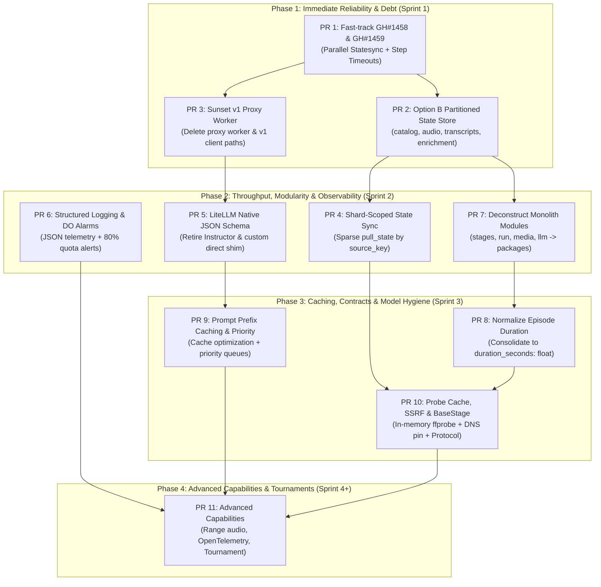

# review/45 — System Architecture Evolution & Refactoring Plan

**Maturity: L3 dev-ready · authored 2026-09-04 · proposed architectural evolution roadmap**

Owner: maintainers & agents. Scope: comprehensive system architecture evolution across
throughput, reliability, observability, LLM job admission/refinement, and structural
codebase refactoring.

---

## §1. Executive Context, Operational Baseline & Motivation

This document establishes the canonical forward architectural and refactoring blueprint for the
`city-meeting-podcasts` repository. Over successive feature phases (Phase H, Phase R, R10 LLM
dispatch v2, R5/R6/R7 enrichment), the codebase expanded to ~65,000 lines of Python and TypeScript.
While individual stages operate effectively, the architecture accumulated critical structural
coupling points, performance bottlenecks, and operational debt:

1. **State Store Concurrency Hazard (TOCTOU)**: Backblaze B2 lacks conditional updates (`If-Match`
   or compare-and-swap). Concurrent GitHub Actions lane workflows (`audio`, `asr`, `tag`,
   `chapter-locator`, `moments`) download, mutate, and re-upload the same monolithic
   `state/sources/<source>/episodes.json` file. Despite `records.merge_preserving_foreign()`,
   concurrent writes risk silent data loss.
2. **Serial & Unfiltered Checkpoint I/O (GH #1458)**: `push_records_merged` processes owned sources
   serially ($N=1$) and re-encodes/re-uploads untouched sources at every checkpoint, causing
   severe wall-clock inflation and runner timeouts in `tag.yml` and other long-running workflows.
3. **Workflow Overrun Reporting Blindspots (GH #1459)**: Long-running workflow jobs lacking
   step-level timeouts get terminated by GitHub's job-level timeout, rendering grey (cancelled)
   and skipping vital trailing reporting steps (e.g., diarization projection, sweep summaries).
4. **Dual-Stack LLM Dispatch Debt**: The system maintains legacy v1 (`workers/llm-dispatch-proxy`,
   R2-backed single-job ingress) alongside v2 (`workers/llm-dispatch-v2`, Durable Object SQLite
   batching), imposing dual-transport logic and complex branching in `citypods/compute/llm.py`.
   PR #1457 established `llm_lanes` as the single source of truth for purpose routing and write
   reservations; v1 has zero active jobs or consumers and is ready for full decommissioning.
5. **Durable Object Quota Exhaustion**: The Cloudflare Workers free plan enforces a 5M daily
   Durable Object row-read ceiling. On 2026-08-27, unindexed bookkeeping scans exhausted this quota,
   halting inference. Pre-breach alerting and structured telemetry are essential.
6. **Core Module Monoliths**: Four files contain ~18,000 lines of code: `stages.py` (7,668 LOC),
   `run.py` (4,240 LOC), `compute/llm.py` (3,040 LOC), and `media.py` (2,980 LOC). This creates
   severe cognitive load, complex merge conflicts, and elevated regression risks.

---

## §2. Option B State-Store Cutover & Global Runner Suspension Runbook

### Rationale for Option B (Clean Cutover)

Rather than maintaining dual-read compatibility paths that perpetuate legacy state parsing, the
system executes a one-time clean cutover to partitioned lane sidecars:
- `state/sources/<source>/catalog.json`: Scrape metadata, meeting dates, titles, and portal links.
- `state/sources/<source>/audio.json`: `audio_spec_hash`, timeline, duration, chapters, audio URLs.
- `state/sources/<source>/transcripts.json`: ASR text, word-level alignments, provider metadata.
- `state/sources/<source>/enrichment.json`: Topic tags, summaries, moments, cards, agendas.

Because each lane workflow writes exclusively to its dedicated sidecar, cross-lane TOCTOU
clobbering on B2 is structurally eliminated.

### Operational Runbook: Global Worker Suspension & Cutover

To prevent in-flight runner jobs from writing legacy state during the migration, follow this
exact suspension procedure:

```bash
# ==============================================================================
# STEP 1: Cancel all in-flight and queued workflow runs
# ==============================================================================
gh run list --status in_progress --json databaseId -q '.[].databaseId' \
  | xargs -I {} gh run cancel {}
gh run list --status queued --json databaseId -q '.[].databaseId' \
  | xargs -I {} gh run cancel {}

# ==============================================================================
# STEP 2: Suspend GitHub Actions repository-wide
# Freezes all scheduled crons, push triggers, and repository dispatch events.
# ==============================================================================
gh api -X PUT /repos/BashfulBits/city-meeting-podcasts/actions/permissions \
  -F enabled=false

# ==============================================================================
# STEP 3: Verify quiet state (0 active runs)
# ==============================================================================
gh run list --status in_progress
gh run list --status queued
# Confirm both return empty output before proceeding.

# ==============================================================================
# STEP 4: Execute the state partitioning migration script
# Splits existing episodes.json into catalog, audio, transcripts, enrichment.
# ==============================================================================
python -m scripts.migrate_state_partitioning --execute --verify

# ==============================================================================
# STEP 5: Deploy the partitioned codebase (Merge PR #2)
# ==============================================================================
git push origin main

# ==============================================================================
# STEP 6: Re-enable GitHub Actions repository-wide
# ==============================================================================
gh api -X PUT /repos/BashfulBits/city-meeting-podcasts/actions/permissions \
  -F enabled=true

# ==============================================================================
# STEP 7: Dispatch a canary verification run
# ==============================================================================
gh workflow run tag.yml -f city=arlington-tx
```

---

## §3. Sunsetting Legacy v1 LLM Dispatch Proxy

With zero active consumers, zero jobs in queue, and PR #1457 having unified all purpose routing
and ingress reservations under `llm_lanes`, legacy v1 is decommissioned completely:

1. **Delete Worker**: Remove `workers/llm-dispatch-proxy/` and associated wrangler configurations.
2. **Purge Client Branches**:
   - In `citypods/compute/llm.py`, delete `_run_remote_proxy()`, legacy R2 ledger parsing, and
     `LLM_DISPATCH_PROXY_URL` routing fallbacks.
   - Standardize all asynchronous remote inference strictly on `workers/llm-dispatch-v2` via
     `enqueue_batch` and `poll_batch`.
3. **Workflow Cleanup**: Remove `LLM_DISPATCH_PROXY_URL` and `LLM_DISPATCH_AUTH_TOKEN` from all
   GitHub Actions workflow secrets and environment blocks.

---

## §4. The 5 Core Architectural Pillars & 16 Initiatives

### Pillar 1: Throughput & Work Distribution

#### Initiative 1: Shard-Scoped State Synchronization (Sparse Fetching)
- **Problem**: Matrix shard runners download all ~3,500 state files across all 85 catalog feeds,
  even when processing only a single city or source shard.
- **Design**: Modify `citypods/state.py:pull_state()` to accept `--source-keys` or `--shard-index`.
  The loader queries the remote prefix index and transfers only files matching the active shard.
- **Impact**: Cuts runner startup state-sync latency by 75–85% (~45–90s saved per matrix job).

#### Initiative 2: In-Process Media Probing Cache & FFmpeg Subprocess Pooling
- **Problem**: A single meeting audio file is independently probed up to four times via `ffprobe`
  during a pipeline execution across `AudioStage`, `SilenceTrimmerStage`, and `ASRStage`.
- **Design**: Implement an in-memory probe cache in `citypods/media.py` keyed by
  `(path, mtime, size)`. Persist probe metadata on episode state records to avoid repeated
  child process spawns.
- **Impact**: Eliminates 300–800ms of process-forking overhead per episode; accelerates local and CI
  builds by 2–4 minutes.

#### Initiative 3: Granular S3/B2 Range-Header Audio Slicing
- **Problem**: Verification stages download entire multi-gigabyte audio files to inspect audio
  continuity, headers, or silence baselines.
- **Design**: Use HTTP Range headers (`Range: bytes=0-1048576`) in `citypods/audio/pipeline.py`
  to fetch stream headers and sample snippets without transferring entire payloads.
- **Impact**: Reduces network transfer for verification stages by up to 95%.

#### Initiative 4: Parallelized & Dirty-Skipping State Push (GH #1458)
- **Problem**: `push_records_merged` serially iterates through owned sources and unconditionally
  re-reads, re-merges, re-encodes, and re-uploads untouched records at every checkpoint.
- **Design**: Parallelize `push_records_merged` using `ThreadPoolExecutor` (bounded to 16 workers)
  and inspect `DIRTY_JOURNAL_NAME` or pre-merge record hashes to skip untouched sources.
- **Impact**: Drops checkpoint latency from 15–30s down to <2s; resolves timeout cancellation in
  `tag.yml` and long-running enrichment workflows.

---

### Pillar 2: Reliability, Idempotency & State Consistency

#### Initiative 5: Partitioned Lane State Store (`catalog.json`, `audio.json`, etc.)
- **Problem**: B2 lacks CAS. Multi-lane CI workflows running concurrently clobber each other's
  mutations in monolithic `episodes.json`.
- **Design**: Enforce isolated single-writer sidecar files partitioned by pipeline domain:
  `catalog.json`, `audio.json`, `transcripts.json`, and `enrichment.json`.
- **Impact**: 100% elimination of cross-lane state clobbers; enables safe concurrent CI lanes.

#### Initiative 6: Step-Level Timeouts & Budget Stop Alignment (GH #1459)
- **Problem**: Overrunning jobs hit GitHub's job-level timeout, cancelling the runner and skipping
  crucial trailing reporting steps.
- **Design**: Add step-level timeouts (sized at ~92–94% of job timeouts) to `r7-diarization.yml`,
  `audio.yml`, `llm-deferred-sweep.yml`, `r5-benchmark.yml`, `tournament-tag-backfill.yml`, and
  `asr.yml`. Align `BaseStage` wall-clock budget checks so stages stop cleanly before step timeouts.
  Add regression assertions to `tests/test_workflows.py`.
- **Impact**: Prevents grey cancelled runs; guarantees trailing reporting steps execute and fail
  visibly as red on true timeouts.

#### Initiative 7: Hardened SSRF Source URL Validator (DNS Pinning & CIDR Checks)
- **Problem**: Time-of-check to time-of-use (TOCTOU) DNS rebinding vulnerability in
  `validate_source_url`: domain is validated, but subsequent `requests.get()` re-resolves DNS.
- **Design**: In `citypods/fetch.py`, resolve the target IP upfront, validate against extended
  private/internal CIDRs (including CGNAT `100.64.0.0/10`), and bind the connection socket
  directly to the pinned IP with the `Host` header set explicitly.
- **Impact**: Complete mitigation of DNS rebinding and internal network scanning vulnerabilities.

#### Initiative 8: Formal `BaseStage` Protocol Contract
- **Problem**: Stages across `citypods/stages.py` have divergent signatures, inconsistent return
  types, and ad-hoc wall-clock stop budget handling.
- **Design**: Establish a runtime-checkable `typing.Protocol` in `citypods/pipeline/contract.py`:
  `execute(ctx: StageContext) -> StageResult` and `should_run(ctx: StageContext) -> bool`.
- **Impact**: Eliminates duck-typing bugs and standardizes wall-clock stop budget enforcement.

---

### Pillar 3: Observability & Operational Telemetry

#### Initiative 9: Structured Event Telemetry & Durable Object Quota Alarms
- **Problem**: Unstructured `print()` logging prevents programmatic log ingestion. Cloudflare
  Durable Object 5M row-read exhaustion hit without pre-breach warning.
- **Design**: Replace raw `print()` with structured JSON logging (`structlog` / `logging`).
  In `workers/llm-dispatch-v2`, implement read-counter telemetry with automated Discord/GitHub
  issue alerts at 80% (4M reads) of the daily quota.
- **Impact**: Real-time visibility into quota consumption and immediate alert on runaway queries.

#### Initiative 10: OpenTelemetry Tracing for Multi-Stage Runner Spans
- **Problem**: Profiling stage duration across distributed runners requires manual log timestamp
  correlation.
- **Design**: Add optional OpenTelemetry span instrumentation in `citypods/telemetry.py` covering
  scrape, probe, transcribe, LLM dispatch, and feed rendering.
- **Impact**: Delivers instant visual waterfall traces of feed processing latency.

---

### Pillar 4: LLM Job Admission, Routing & Refinement

#### Initiative 11: Sunset v1 Proxy & Consolidate on v2 with `llm_lanes`
- **Problem**: Dual-stack transport maintenance and bifurcated code paths.
- **Design**: Decommission `workers/llm-dispatch-proxy/`, standardize on `workers/llm-dispatch-v2/`,
  and drive all admission from the unified `llm_lanes` configuration introduced in PR #1457.
- **Impact**: Cuts ~800 lines of legacy code and unifies provider routing logic.

#### Initiative 12: Unified Structured Output via LiteLLM Native JSON Schema
- **Problem**: Instructor 1.15.4's lack of native Gemini JSON Schema support forced a hand-rolled
  shim (`_run_native_structured_direct()`) in `compute/llm.py`.
- **Design**: Upgrade LiteLLM and use `response_format={"type": "json_object", "schema": ...}`
  with direct Pydantic model validation across all providers.
- **Impact**: Retires ~350 LOC of fragile custom shims; standardizes schema enforcement across
  OpenAI, Gemini, Anthropic, and DeepSeek.

#### Initiative 13: Model-Specific Prefix Prompt Caching
- **Problem**: Dynamic variables placed early in prompt templates bust provider prefix caches.
- **Design**: Restructure prompts in `citypods/compute/prompts/` to place invariant system
  instructions, few-shot exemplars, and schemas at the prefix, padding to provider cache
  boundaries (1,024 tokens for Anthropic, 32,768 tokens for Gemini).
- **Impact**: Reduces LLM input token costs by 50–75% and cuts time-to-first-token by 40%.

#### Initiative 14: Dynamic Budget Allocation & Priority Queuing on `llm_lanes`
- **Problem**: High-volume backfills saturate worker admission, starving daily active feeds.
- **Design**: In `workers/llm-dispatch-v2`, enforce priority queues (`high`: active meeting
  publication; `low`: historical archive backfills) keyed by `llm_lanes` write reservations.
- **Impact**: Zero queuing delay for active daily municipal feeds regardless of backfill volume.

#### Initiative 15: Calibrated Confidence Estimation & Deterministic Fallbacks
- **Problem**: Occasional LLM hallucination during low-audio-quality segments produces invalid
  chapter timestamps or inaccurate agenda links.
- **Design**: Implement heuristic confidence scoring; candidates scoring below threshold fall back
  to deterministic regex/keyword extractors, preserving the untrusted LLM invariant.
- **Impact**: Eliminates publication of corrupted chapter boundaries and preserves
  timeline integrity.

#### Initiative 16: Autonomous Evaluator Tournament Engine
- **Problem**: Prompt revisions and model upgrades currently rely on subjective manual checks.
- **Design**: Add an automated tournament harness in `scripts/eval_prompt_tournament.py` to evaluate
  candidate prompts against golden meeting transcripts, scoring cost, latency, and accuracy.
- **Impact**: Data-driven, empirical validation for all future prompt and model migrations.

---

### Pillar 5: Architectural Consistency & De-Monolithization

#### Initiative 17: Modularize 4 Monolith Modules (<1,000 LOC per File)
- **Problem**: `stages.py` (7.6k LOC), `run.py` (4.2k LOC), `compute/llm.py` (3.0k LOC), and
  `media.py` (3.0k LOC) are oversized monoliths that impede safe refactoring.
- **Design**: Refactor into cohesive packages with backward-compatible top-level facade imports:
  - `citypods/stages/` (`audio.py`, `asr.py`, `enrichment.py`, `render.py`)
  - `citypods/runner/` (`cli.py`, `orchestrator.py`, `budget.py`, `matrix.py`)
  - `citypods/compute/llm/` (`client.py`, `schemas.py`, `batch.py`, `cost.py`)
  - `citypods/media/` (`probe.py`, `ffmpeg.py`, `silence.py`, `tags.py`)
- **Impact**: Dramatic reduction in merge conflicts, faster linting/indexing, and clean unit tests.

#### Initiative 18: Normalize `Episode` Model & Consolidate Duration Fields
- **Problem**: Three competing duration fields (`duration`, `duration_seconds`, `audio_duration`)
  with mixed types (float, int, string `"HH:MM:SS"`) cause parsing confusion.
- **Design**: Standardize on `duration_seconds: float` on `Episode` in `citypods/records.py`.
  Provide property helpers (`formatted_duration`) for presentation without mutating raw data.
- **Impact**: Eliminates repeated string parsing and resolves subtle off-by-one timeline bugs.

---

## §5. Phasing & PR Sequencing Plan



### Detailed PR Breakdown

| PR | Title & Focus | Files Touched | Dependencies | Exit Criteria |
|---|---|---|---|---|
| **PR 1** | **Fast-track GH #1458 & GH #1459** (Parallel statesync + step timeouts) | `citypods/statesync.py`, `.github/workflows/*.yml`, `tests/test_workflows.py` | None | `push_records_merged` parallelized; step timeouts asserted in tests; clean CI. |
| **PR 2** | **Option B Partitioned State Store** (Sidecars + migration script) | `citypods/records.py`, `citypods/state.py`, `scripts/migrate_state_partitioning.py` | PR 1 | Runbook executed; sidecars active; 0 cross-lane clobbers in live runs. |
| **PR 3** | **Decommission v1 LLM Dispatch Proxy** | `workers/llm-dispatch-proxy/`, `citypods/compute/llm.py`, `.github/workflows/*.yml` | PR 1 | Worker removed; v1 client code purged; all routes dispatch via v2. |
| **PR 4** | **Shard-Scoped State Synchronization** | `citypods/state.py`, `citypods/cli.py`, `.github/workflows/*.yml` | PR 2 | Runners pull only active shard files; startup transfer reduced >75%. |
| **PR 5** | **LiteLLM Native JSON Schema Unification** | `citypods/compute/llm.py`, `pyproject.toml`, `constraints/*.txt` | PR 3 | Instructor & custom direct shim removed; Pydantic validation on all models. |
| **PR 6** | **Structured Telemetry & DO Quota Alarms** | `citypods/run.py`, `workers/llm-dispatch-v2/src/coordinator.js` | None | JSON logs in CI; automated alert fires when DO rows-read exceed 80%. |
| **PR 7** | **Deconstruct Monolithic Modules** | `citypods/stages/`, `citypods/runner/`, `citypods/media/`, `citypods/compute/llm/` | PR 2 | All 4 files split into subpackages <1,000 LOC each; facades preserve imports. |
| **PR 8** | **Episode Schema Normalization** | `citypods/records.py`, `citypods/render.py`, `templates/*.j2` | PR 7 | Single `duration_seconds: float` field; all template formatters verified. |
| **PR 9** | **Prompt Prefix Caching & Priority Queuing** | `citypods/compute/prompts/`, `workers/llm-dispatch-v2/` | PR 5 | Token costs drop >50% on cached routes; active feeds prioritized over backfills. |
| **PR 10** | **Media Cache, SSRF Pinning & Stage Protocol**| `citypods/media/probe.py`, `citypods/fetch.py`, `citypods/stages/contract.py` | PR 4, PR 7 | In-memory probe cache hits verified; DNS pinning tested; BaseStage enforced. |
| **PR 11** | **Advanced Telemetry & Autonomous Tournaments**| `citypods/telemetry.py`, `citypods/audio/`, `scripts/eval_tournament.py` | PR 6, PR 9 | OTel spans functional; range queries slice audio; tournament ranks prompts. |

---

## §6. Testing, Verification & Golden Snapshot Plan

1. **Static Analysis & Linters**:
   - Every PR must pass `ruff check .` and `ruff format --check .` under the
     strict 100-character limit.
   - Enforce type annotations via `mypy` on all newly extracted subpackages.
2. **Offline Test Suite Execution**:
   - Maintain 100% pass rate across the offline test suite (`pytest -q`, 3,730+ tests).
3. **Workflow Timeout Assertions**:
   - `tests/test_workflows.py` asserts step-level timeouts for all long-running workflows to
     prevent regressions (GH #1459).
4. **Golden Snapshot Integrity**:
   - Feed and page rendering outputs must be validated with `SNAPSHOT_UPDATE=1 pytest` whenever
     schema formatters or render templates are refactored.
5. **Durable Object Mutation & Invariant Guards**:
   - Run `test/rows-read.test.js` in `workers/llm-dispatch-v2/` to ensure no database statement
     scans an unbounded or traffic-growable table.

---

## §7. Documentation & Architectural Contract Updates

Per the repository lifecycle contract in `CONTRIBUTING.md` and `review/11`:
- **`review/11-technical-design-roadmap.md`**: Add catalog row for `review/45` under the Active
  Architectural Evolution Series (L3 dev-ready).
- **`ROADMAP.md`**: Update core engineering priorities with references to `review/45`.
- **`ARCHITECTURE.md`**: Document the target partitioned state store architecture and v2 dispatch.
- **`CHANGELOG.md`**: Record the adoption of RFC `review/45` as the strategic refactoring plan.
